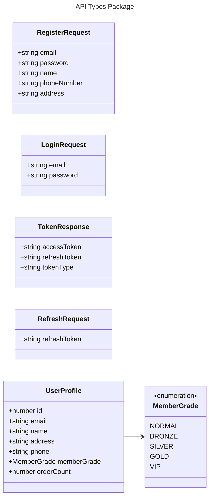
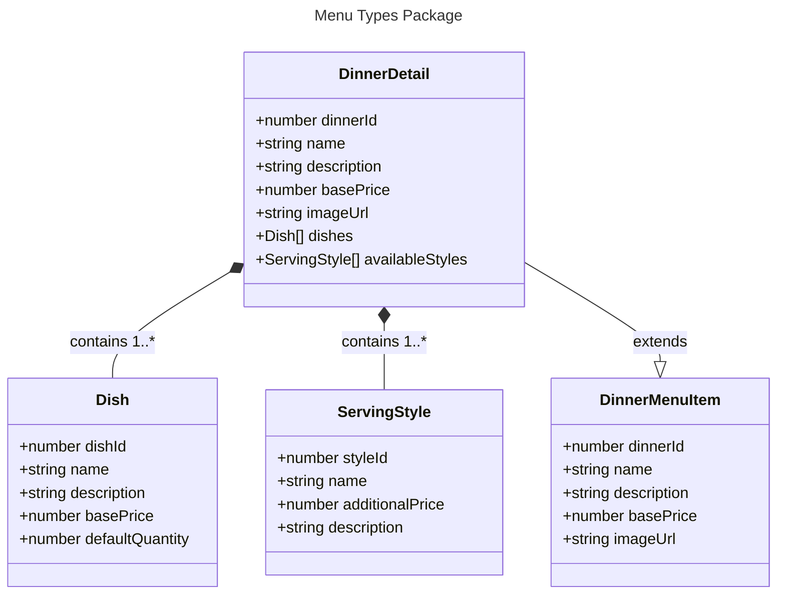
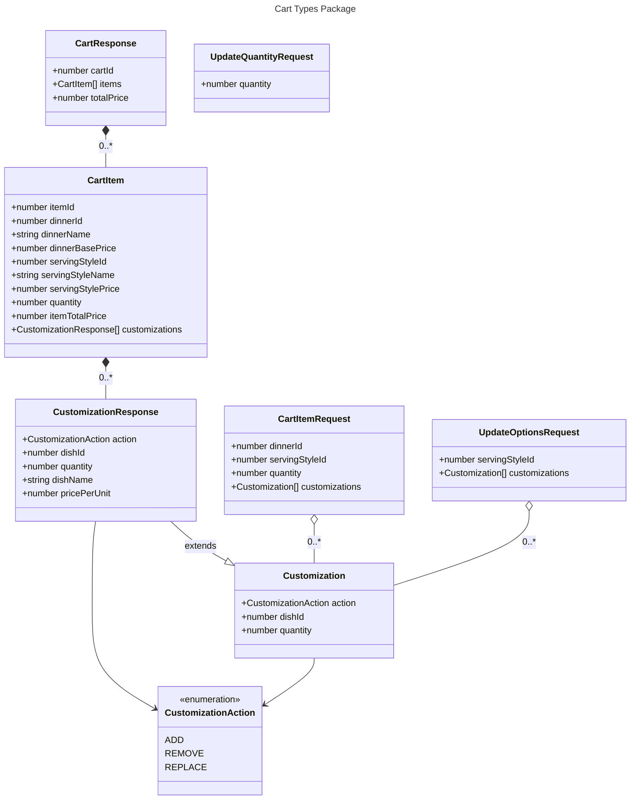
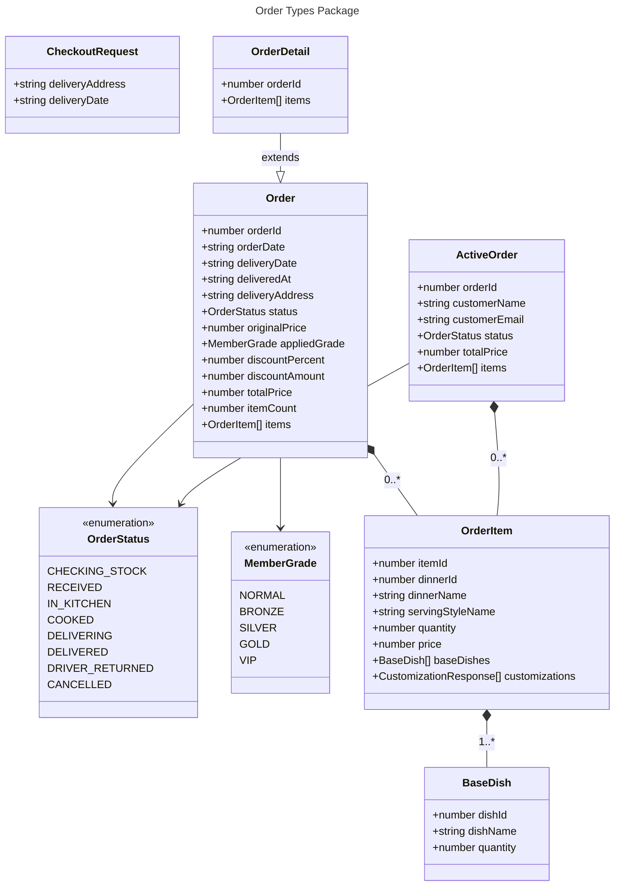
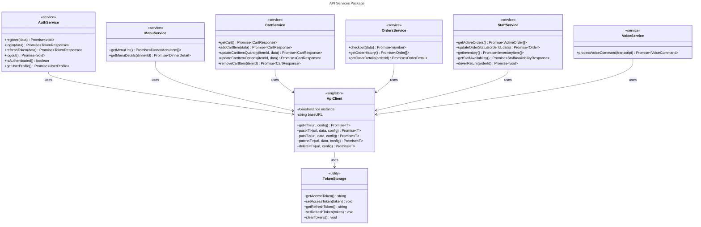
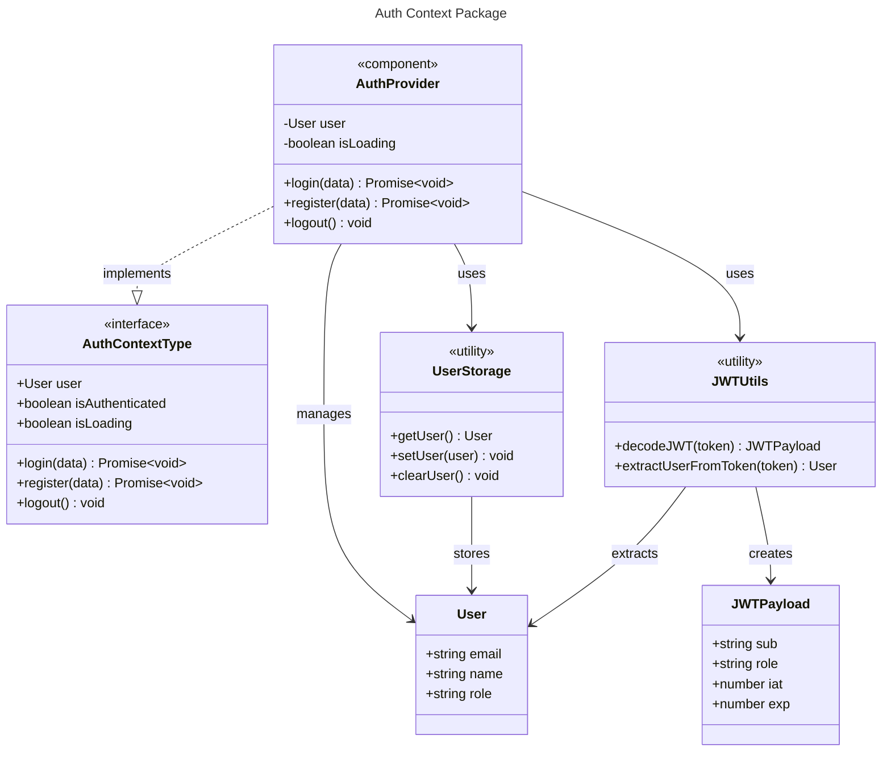
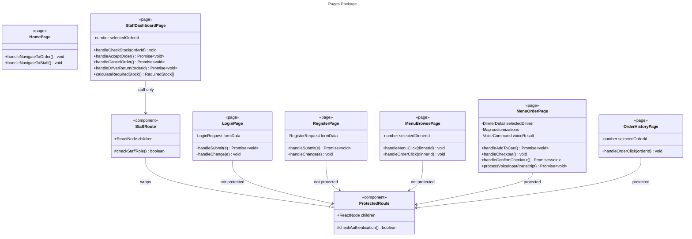
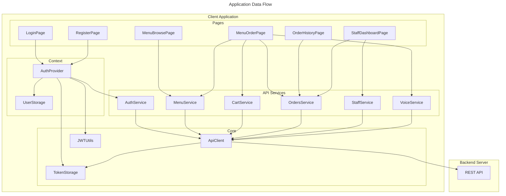

# DDogan Zip Frontend - Class Diagram

이 문서는 DDogan Zip Frontend 애플리케이션의 클래스 다이어그램을 Mermaid 형식으로 제공합니다.

## Mermaid Live Editor에서 보기

아래 다이어그램을 [Mermaid Live Editor (Playground)](https://mermaid.live/)에 붙여넣어 예쁘게 시각화할 수 있습니다.

---

## 전체 클래스 다이어그램

```mermaid
---
title: DDogan Zip Frontend - Client Application Class Diagram
---
classDiagram
    direction TB

    %% ═══════════════════════════════════════════════════════════════
    %% NAMESPACE: API Types (src/api/types.ts)
    %% ═══════════════════════════════════════════════════════════════

    namespace API_Types {

        class SuccessResponse~T~ {
            +boolean success
            +string message
            +T data
        }

        class ErrorResponse {
            +ErrorDetail error
        }

        class ErrorDetail {
            +string code
            +string message
            +any details
        }

        class RegisterRequest {
            +string email
            +string password
            +string name
            +string phoneNumber
            +string address
        }

        class LoginRequest {
            +string email
            +string password
        }

        class TokenResponse {
            +string accessToken
            +string refreshToken
            +string tokenType
        }

        class RefreshRequest {
            +string refreshToken
        }

        class UserProfile {
            +number id
            +string email
            +string name
            +string address
            +string phone
            +MemberGrade memberGrade
            +number orderCount
        }

        class Dish {
            +number dishId
            +string name
            +string description
            +number basePrice
            +number defaultQuantity
        }

        class ServingStyle {
            +number styleId
            +string name
            +number additionalPrice
            +string description
        }

        class DinnerMenuItem {
            +number dinnerId
            +string name
            +string description
            +number basePrice
            +string imageUrl
        }

        class DinnerDetail {
            +number dinnerId
            +string name
            +string description
            +number basePrice
            +string imageUrl
            +Dish[] dishes
            +ServingStyle[] availableStyles
        }

        class Customization {
            +CustomizationAction action
            +number dishId
            +number quantity
        }

        class CustomizationResponse {
            +CustomizationAction action
            +number dishId
            +number quantity
            +string dishName
            +number pricePerUnit
        }

        class CartItemRequest {
            +number dinnerId
            +number servingStyleId
            +number quantity
            +Customization[] customizations
        }

        class CartItem {
            +number itemId
            +number dinnerId
            +string dinnerName
            +number dinnerBasePrice
            +number servingStyleId
            +string servingStyleName
            +number servingStylePrice
            +number quantity
            +number itemTotalPrice
            +CustomizationResponse[] customizations
        }

        class CartResponse {
            +number cartId
            +CartItem[] items
            +number totalPrice
        }

        class UpdateQuantityRequest {
            +number quantity
        }

        class UpdateOptionsRequest {
            +number servingStyleId
            +Customization[] customizations
        }

        class CustomizeItemRequest {
            +CustomizationAction action
            +number dishId
            +number quantity
        }

        class CheckoutRequest {
            +string deliveryAddress
            +string deliveryDate
        }

        class CheckoutResponse {
            +boolean success
            +string message
            +number data
        }

        class BaseDish {
            +number dishId
            +string dishName
            +number quantity
        }

        class OrderItem {
            +number itemId
            +number dinnerId
            +string dinnerName
            +string servingStyleName
            +number quantity
            +number price
            +BaseDish[] baseDishes
            +CustomizationResponse[] customizations
        }

        class Order {
            +number orderId
            +string orderDate
            +string deliveryDate
            +string deliveredAt
            +string deliveryAddress
            +OrderStatus status
            +number originalPrice
            +MemberGrade appliedGrade
            +number discountPercent
            +number discountAmount
            +number totalPrice
            +number itemCount
            +OrderItem[] items
        }

        class OrderDetail {
            +number orderId
            +string orderDate
            +string deliveryDate
            +string deliveredAt
            +string deliveryAddress
            +OrderStatus status
            +number originalPrice
            +MemberGrade appliedGrade
            +number discountPercent
            +number discountAmount
            +number totalPrice
            +number itemCount
            +OrderItem[] items
        }

        class UpdateOrderStatusRequest {
            +OrderStatus status
        }

        class StaffAvailabilityResponse {
            +number availableCooks
            +number totalCooks
            +number availableDrivers
            +number totalDrivers
            +boolean canStartCooking
            +boolean canStartDelivery
        }

        class ActiveOrder {
            +number orderId
            +string customerName
            +string customerEmail
            +string orderDate
            +string deliveryDate
            +string deliveredAt
            +string deliveryAddress
            +OrderStatus status
            +number totalPrice
            +number itemCount
            +OrderItem[] items
        }

        class InventoryItem {
            +number dishId
            +string dishName
            +number currentStock
            +number minimumStock
        }

        class VoiceCommand {
            +VoiceAction action
            +string dinner_type
            +string serving_style
            +number quantity
            +string reply
        }

    }

    %% ═══════════════════════════════════════════════════════════════
    %% NAMESPACE: Enumerations
    %% ═══════════════════════════════════════════════════════════════

    namespace Enums {

        class MemberGrade {
            <<enumeration>>
            NORMAL
            BRONZE
            SILVER
            GOLD
            VIP
        }

        class OrderStatus {
            <<enumeration>>
            CHECKING_STOCK
            RECEIVED
            IN_KITCHEN
            COOKED
            DELIVERING
            DELIVERED
            DRIVER_RETURNED
            CANCELLED
        }

        class CustomizationAction {
            <<enumeration>>
            ADD
            REMOVE
            REPLACE
        }

        class VoiceAction {
            <<enumeration>>
            order
            cancel
            checkout
            unknown
        }

    }

    %% ═══════════════════════════════════════════════════════════════
    %% NAMESPACE: API Client (src/api/client.ts)
    %% ═══════════════════════════════════════════════════════════════

    namespace API_Client {

        class ApiClient {
            <<singleton>>
            -AxiosInstance instance
            -string baseURL
            +get~T~(url, config) Promise~T~
            +post~T~(url, data, config) Promise~T~
            +put~T~(url, data, config) Promise~T~
            +patch~T~(url, data, config) Promise~T~
            +delete~T~(url, config) Promise~T~
        }

        class TokenStorage {
            <<utility>>
            +getAccessToken() string
            +setAccessToken(token) void
            +getRefreshToken() string
            +setRefreshToken(token) void
            +clearTokens() void
        }

        class RequestInterceptor {
            <<interceptor>>
            +addAuthorizationHeader(config) AxiosRequestConfig
        }

        class ResponseInterceptor {
            <<interceptor>>
            +handleTokenRefresh(error) Promise
        }

    }

    %% ═══════════════════════════════════════════════════════════════
    %% NAMESPACE: API Services
    %% ═══════════════════════════════════════════════════════════════

    namespace API_Services {

        class AuthService {
            <<service>>
            +register(data: RegisterRequest) Promise~void~
            +login(data: LoginRequest) Promise~TokenResponse~
            +refreshToken(data: RefreshRequest) Promise~TokenResponse~
            +logout() Promise~void~
            +isAuthenticated() boolean
            +getUserProfile() Promise~UserProfile~
        }

        class MenuService {
            <<service>>
            +getMenuList() Promise~DinnerMenuItem[]~
            +getMenuDetails(dinnerId: number) Promise~DinnerDetail~
            +getMenuItems() Promise~MenuItem[]~
        }

        class CartService {
            <<service>>
            +getCart() Promise~CartResponse~
            +addCartItem(data: CartItemRequest) Promise~CartResponse~
            +updateCartItemQuantity(itemId, data) Promise~CartResponse~
            +updateCartItemOptions(itemId, data) Promise~CartResponse~
            +removeCartItem(itemId: number) Promise~CartResponse~
            +customizeCartItem(itemId, data) Promise~CartResponse~
        }

        class OrdersService {
            <<service>>
            +checkout(data: CheckoutRequest) Promise~number~
            +getOrderHistory() Promise~Order[]~
            +getOrderDetails(orderId: number) Promise~OrderDetail~
            +placeOrder(cart: CartItem[]) Promise
            +getPendingOrders() Promise~Order[]~
        }

        class StaffService {
            <<service>>
            +getActiveOrders() Promise~ActiveOrder[]~
            +updateOrderStatus(orderId, data) Promise~Order~
            +getInventory() Promise~InventoryItem[]~
            +getStaffAvailability() Promise~StaffAvailabilityResponse~
            +driverReturn(orderId: number) Promise~void~
        }

        class VoiceService {
            <<service>>
            +processVoiceCommand(transcript: string) Promise~VoiceCommand~
        }

    }

    %% ═══════════════════════════════════════════════════════════════
    %% NAMESPACE: Utilities (src/utils/)
    %% ═══════════════════════════════════════════════════════════════

    namespace Utils {

        class JWTPayload {
            +string sub
            +string role
            +number iat
            +number exp
        }

        class JWTUtils {
            <<utility>>
            +decodeJWT(token: string) JWTPayload
            +extractUserFromToken(token: string) UserInfo
        }

        class UserInfo {
            +string email
            +string name
            +string role
        }

    }

    %% ═══════════════════════════════════════════════════════════════
    %% NAMESPACE: Context (src/contexts/)
    %% ═══════════════════════════════════════════════════════════════

    namespace Context {

        class User {
            +string email
            +string name
            +string role
        }

        class AuthContextType {
            <<interface>>
            +User user
            +boolean isAuthenticated
            +boolean isLoading
            +login(data: LoginRequest) Promise~void~
            +register(data: RegisterRequest) Promise~void~
            +logout() void
        }

        class AuthProvider {
            <<component>>
            -User user
            -boolean isLoading
            +login(data: LoginRequest) Promise~void~
            +register(data: RegisterRequest) Promise~void~
            +logout() void
            +useAuth() AuthContextType
        }

        class UserStorage {
            <<utility>>
            +getUser() User
            +setUser(user: User) void
            +clearUser() void
        }

    }

    %% ═══════════════════════════════════════════════════════════════
    %% NAMESPACE: Components (src/components/)
    %% ═══════════════════════════════════════════════════════════════

    namespace Components {

        class ProtectedRoute {
            <<component>>
            +ReactNode children
            #checkAuthentication() boolean
            +render() ReactElement
        }

        class StaffRoute {
            <<component>>
            +ReactNode children
            #checkStaffRole() boolean
            +render() ReactElement
        }

        class Layout {
            <<component>>
            +renderNavigation() ReactElement
            +renderUserMenu() ReactElement
            +render() ReactElement
        }

        class ColorModeToggle {
            <<component>>
            +toggleColorMode() void
            +render() ReactElement
        }

    }

    %% ═══════════════════════════════════════════════════════════════
    %% NAMESPACE: Pages (src/pages/)
    %% ═══════════════════════════════════════════════════════════════

    namespace Pages {

        class HomePage {
            <<page>>
            +renderHeroSection() ReactElement
            +renderFeaturesGrid() ReactElement
            +renderCTASection() ReactElement
            +handleNavigateToOrder() void
            +handleNavigateToStaff() void
        }

        class LoginPage {
            <<page>>
            -LoginRequest formData
            +handleSubmit(e: FormEvent) Promise~void~
            +handleChange(e: ChangeEvent) void
            +render() ReactElement
        }

        class RegisterPage {
            <<page>>
            -RegisterRequest formData
            +handleSubmit(e: FormEvent) Promise~void~
            +handleChange(e: ChangeEvent) void
            +render() ReactElement
        }

        class MenuBrowsePage {
            <<page>>
            -number selectedDinnerId
            -boolean isModalOpen
            +handleMenuClick(dinnerId: number) void
            +handleOrderClick(dinnerId: number) void
            +renderMenuGrid() ReactElement
            +renderDetailModal() ReactElement
        }

        class MenuOrderPage {
            <<page>>
            -DinnerDetail selectedDinner
            -string selectedStyleId
            -number quantity
            -Map~number,Customization~ customizations
            -string deliveryAddress
            -string deliveryDate
            -VoiceCommand voiceResult
            -boolean isProcessing
            +handleMenuClick(dinner: DinnerDetail) void
            +handleAddToCart() Promise~void~
            +handleCustomizationQuantityChange(dishId, currentQty, defaultQty) void
            +handleCheckout() void
            +handleConfirmCheckout() Promise~void~
            +processVoiceInput(transcript: string) Promise~void~
            +calculateItemPrice() number
            +renderVoiceSection() ReactElement
            +renderCartSection() ReactElement
            +renderMenuList() ReactElement
            +renderDetailModal() ReactElement
            +renderCheckoutModal() ReactElement
        }

        class OrderHistoryPage {
            <<page>>
            -number selectedOrderId
            -boolean isModalOpen
            +handleOrderClick(orderId: number) void
            +getStatusConfig(status: OrderStatus) StatusConfig
            +renderOrderCards() ReactElement
            +renderDetailModal() ReactElement
        }

        class StaffDashboardPage {
            <<page>>
            -number selectedOrderId
            -boolean isModalOpen
            +handleCheckStock(orderId: number) void
            +handleAcceptOrder() Promise~void~
            +handleCancelOrder() Promise~void~
            +handleStatusChange(orderId, status) Promise~void~
            +handleDriverReturn(orderId: number) Promise~void~
            +calculateRequiredStock() RequiredStock[]
            +renderStatsCards() ReactElement
            +renderOrderManagementTab() ReactElement
            +renderInventoryTab() ReactElement
            +renderStockCheckModal() ReactElement
        }

        class RequiredStock {
            +number dishId
            +string dishName
            +number required
            +number available
            +boolean isInsufficient
        }

    }

    %% ═══════════════════════════════════════════════════════════════
    %% NAMESPACE: Configuration
    %% ═══════════════════════════════════════════════════════════════

    namespace Config {

        class MemberGradeConfig {
            <<constant>>
            +string label
            +number discountPercent
            +string colorScheme
        }

        class StatusConfig {
            <<constant>>
            +string label
            +string colorScheme
            +ReactElement icon
        }

        class NextStatuses {
            <<constant>>
            +OrderStatus[] getNextStatuses(status: OrderStatus)
        }

    }

    %% ═══════════════════════════════════════════════════════════════
    %% RELATIONSHIPS
    %% ═══════════════════════════════════════════════════════════════

    %% Inheritance & Implementation
    CustomizationResponse --|> Customization : extends
    OrderDetail --|> Order : extends
    StaffRoute --|> ProtectedRoute : wraps

    %% Composition (strong ownership)
    DinnerDetail *-- Dish : contains
    DinnerDetail *-- ServingStyle : contains
    CartResponse *-- CartItem : contains
    CartItem *-- CustomizationResponse : contains
    Order *-- OrderItem : contains
    OrderItem *-- BaseDish : contains
    OrderItem *-- CustomizationResponse : contains
    ActiveOrder *-- OrderItem : contains
    ErrorResponse *-- ErrorDetail : contains

    %% Aggregation (weak ownership)
    CartItemRequest o-- Customization : includes
    UpdateOptionsRequest o-- Customization : includes

    %% Dependencies
    UserProfile --> MemberGrade : uses
    Order --> OrderStatus : uses
    Order --> MemberGrade : uses
    ActiveOrder --> OrderStatus : uses
    Customization --> CustomizationAction : uses
    CustomizationResponse --> CustomizationAction : uses
    CustomizeItemRequest --> CustomizationAction : uses
    VoiceCommand --> VoiceAction : uses
    UpdateOrderStatusRequest --> OrderStatus : uses

    %% Service Dependencies
    ApiClient --> TokenStorage : uses
    ApiClient --> RequestInterceptor : uses
    ApiClient --> ResponseInterceptor : uses
    ResponseInterceptor --> TokenStorage : uses

    AuthService --> ApiClient : uses
    AuthService --> LoginRequest : accepts
    AuthService --> RegisterRequest : accepts
    AuthService --> TokenResponse : returns
    AuthService --> UserProfile : returns

    MenuService --> ApiClient : uses
    MenuService --> DinnerMenuItem : returns
    MenuService --> DinnerDetail : returns

    CartService --> ApiClient : uses
    CartService --> CartItemRequest : accepts
    CartService --> CartResponse : returns
    CartService --> UpdateQuantityRequest : accepts
    CartService --> UpdateOptionsRequest : accepts

    OrdersService --> ApiClient : uses
    OrdersService --> CheckoutRequest : accepts
    OrdersService --> Order : returns
    OrdersService --> OrderDetail : returns

    StaffService --> ApiClient : uses
    StaffService --> ActiveOrder : returns
    StaffService --> InventoryItem : returns
    StaffService --> StaffAvailabilityResponse : returns
    StaffService --> UpdateOrderStatusRequest : accepts

    VoiceService --> ApiClient : uses
    VoiceService --> VoiceCommand : returns

    %% Utility Dependencies
    JWTUtils --> JWTPayload : creates
    JWTUtils --> UserInfo : creates

    %% Context Dependencies
    AuthProvider --> AuthService : uses
    AuthProvider --> TokenStorage : uses
    AuthProvider --> JWTUtils : uses
    AuthProvider --> User : manages
    AuthProvider ..> AuthContextType : implements

    UserStorage --> User : stores

    %% Component Dependencies
    ProtectedRoute --> AuthProvider : uses
    StaffRoute --> AuthProvider : uses
    Layout --> AuthProvider : uses
    Layout --> ColorModeToggle : contains

    %% Page Dependencies
    LoginPage --> AuthProvider : uses
    LoginPage --> LoginRequest : creates

    RegisterPage --> AuthProvider : uses
    RegisterPage --> RegisterRequest : creates

    MenuBrowsePage --> MenuService : uses
    MenuBrowsePage --> DinnerMenuItem : displays
    MenuBrowsePage --> DinnerDetail : displays

    MenuOrderPage --> MenuService : uses
    MenuOrderPage --> CartService : uses
    MenuOrderPage --> OrdersService : uses
    MenuOrderPage --> VoiceService : uses
    MenuOrderPage --> AuthService : uses
    MenuOrderPage --> DinnerDetail : uses
    MenuOrderPage --> CartResponse : uses
    MenuOrderPage --> VoiceCommand : uses
    MenuOrderPage --> Customization : manages
    MenuOrderPage --> CheckoutRequest : creates

    OrderHistoryPage --> OrdersService : uses
    OrderHistoryPage --> Order : displays
    OrderHistoryPage --> OrderDetail : displays
    OrderHistoryPage --> StatusConfig : uses

    StaffDashboardPage --> StaffService : uses
    StaffDashboardPage --> OrdersService : uses
    StaffDashboardPage --> ActiveOrder : displays
    StaffDashboardPage --> InventoryItem : displays
    StaffDashboardPage --> StaffAvailabilityResponse : displays
    StaffDashboardPage --> RequiredStock : calculates
    StaffDashboardPage --> StatusConfig : uses

    %% Configuration Dependencies
    MemberGradeConfig --> MemberGrade : configures
    StatusConfig --> OrderStatus : configures
    NextStatuses --> OrderStatus : maps
```

---

## 패키지별 상세 다이어그램

더 세밀한 분석을 위해 각 패키지별로 분리된 다이어그램을 제공합니다.

### 1. API Types 패키지



### 2. Menu Types 패키지



### 3. Cart Types 패키지



### 4. Order Types 패키지



### 5. Services 패키지



### 6. Context & Auth 패키지



### 7. Pages 패키지



---

## 데이터 흐름 다이어그램



---

## 사용 방법

1. **Mermaid Live Editor 접속**: https://mermaid.live/
2. **코드 복사**: 위의 Mermaid 코드 블록 중 원하는 다이어그램을 복사
3. **붙여넣기**: Editor 왼쪽 패널에 붙여넣기
4. **다운로드**: 오른쪽 패널에서 PNG/SVG 형식으로 다운로드

## 참고사항

- **방향 설정**: `direction TB` (위에서 아래), `direction LR` (왼쪽에서 오른쪽)
- **관계 표시**:
  - `--|>`: 상속 (inheritance)
  - `..|>`: 구현 (implementation)
  - `*--`: 합성 (composition, 강한 소유)
  - `o--`: 집합 (aggregation, 약한 소유)
  - `-->`: 의존성 (dependency)
- **스테레오타입**: `<<enumeration>>`, `<<interface>>`, `<<service>>`, `<<component>>`, `<<page>>` 등
