# DDogan Zip Frontend - Class Diagram (Updated)

이 문서는 DDogan Zip Frontend 애플리케이션의 클래스 다이어그램을 Mermaid 형식으로 제공합니다.
음성 주문 시스템 (Groq AI)이 추가된 최신 버전입니다.

## Mermaid Live Editor에서 보기

아래 다이어그램을 [Mermaid Live Editor (Playground)](https://mermaid.live/)에 붙여넣어 시각화할 수 있습니다.

---

## 1. 전체 아키텍처 개요

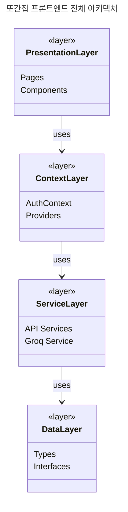

---

## 2. 인증 및 회원 타입

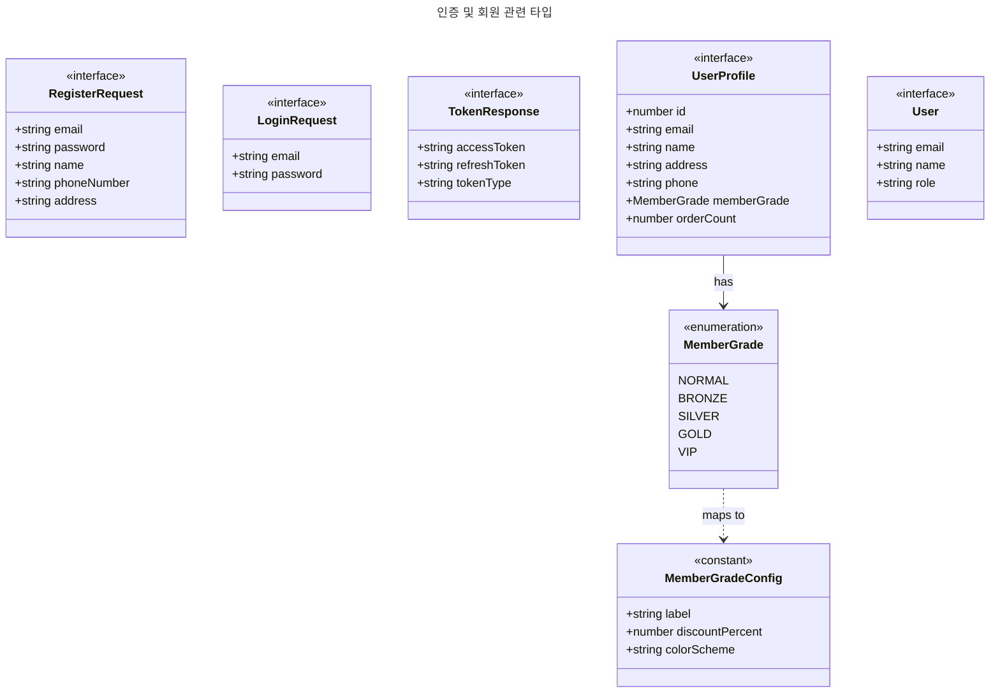

---

## 3. 메뉴 및 요리 타입

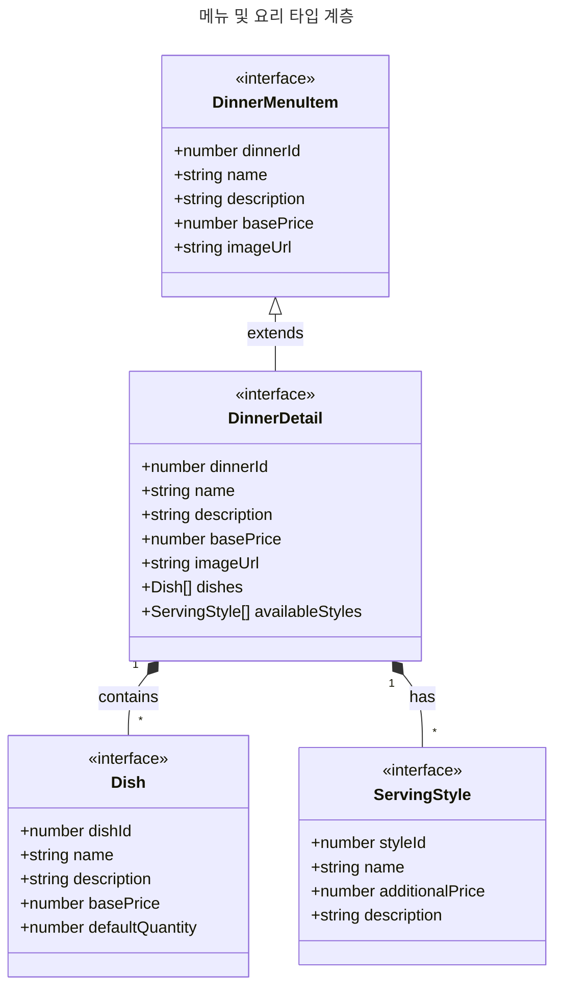

---

## 4. 장바구니 및 커스터마이징 타입

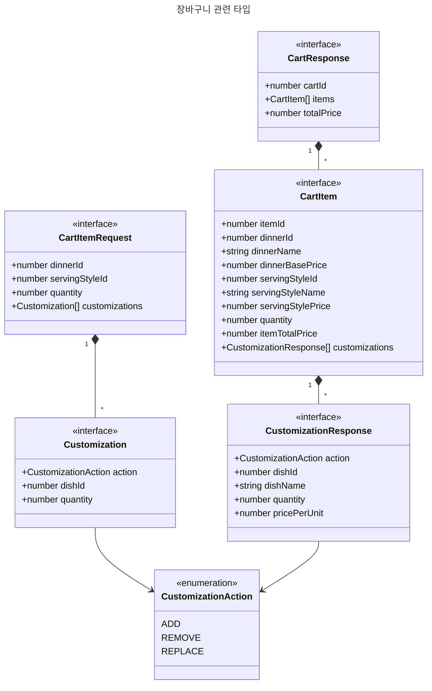

---

## 5. 주문 관련 타입

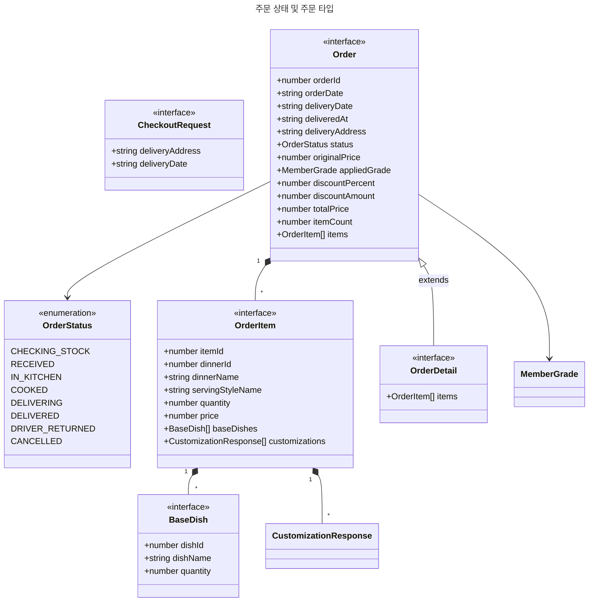

---

## 6. 직원 관련 타입

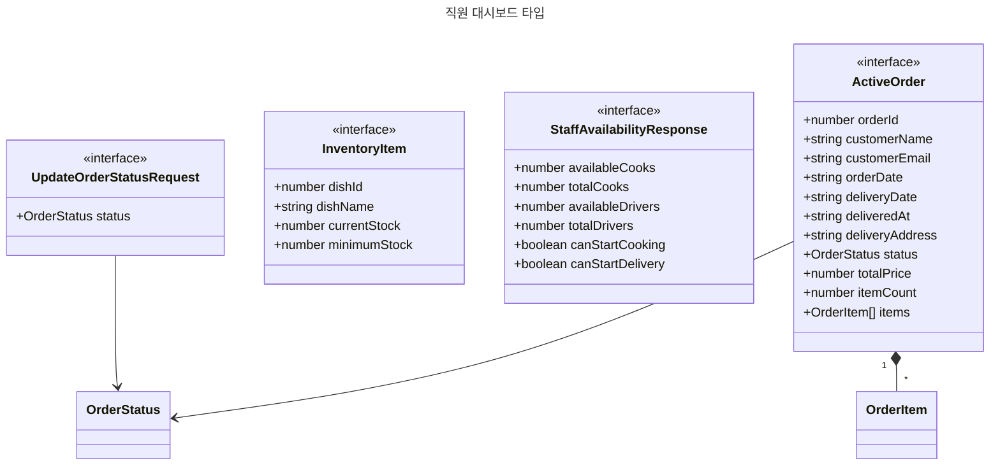

---

## 7. API 서비스 계층

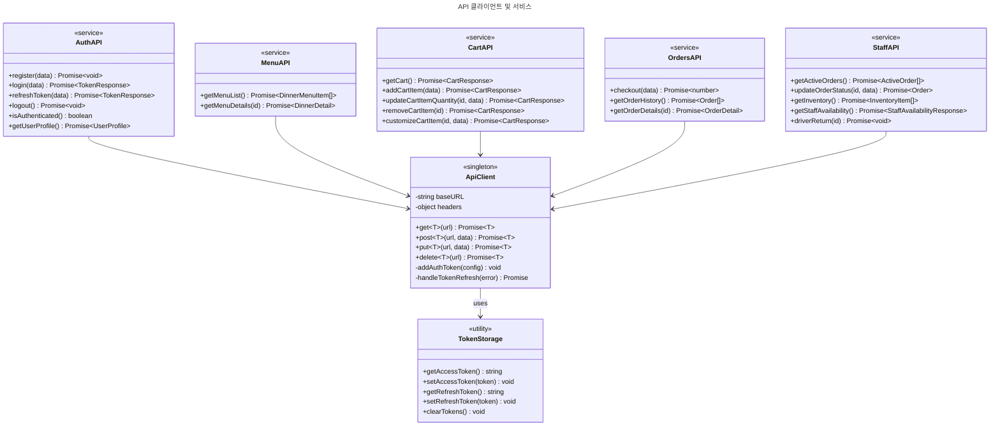

---

## 8. Groq AI 음성 주문 서비스

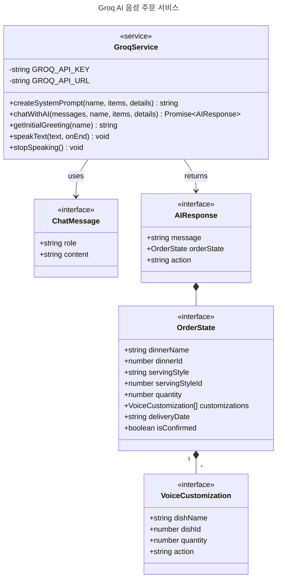

---

## 9. Context 및 상태 관리

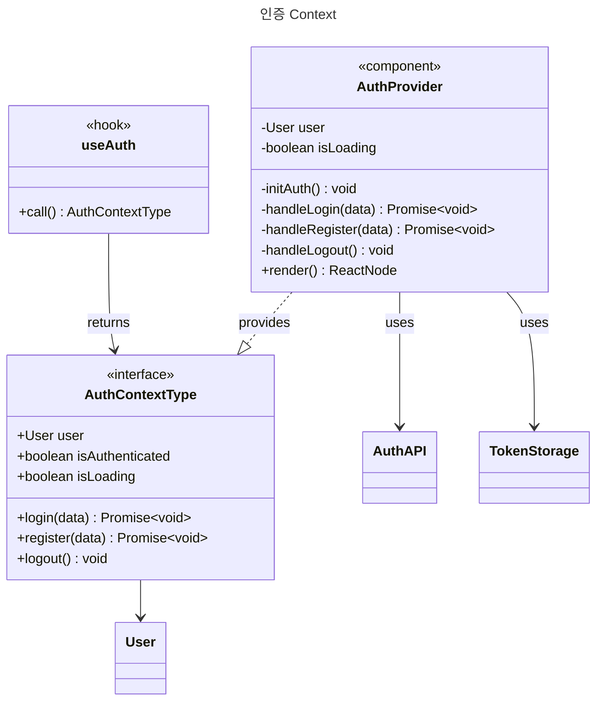

---

## 10. 컴포넌트 계층

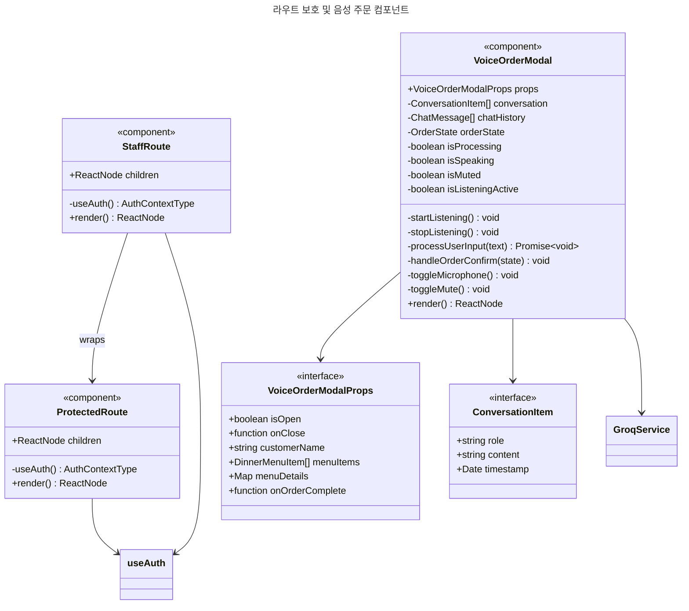

---

## 11. 페이지 컴포넌트

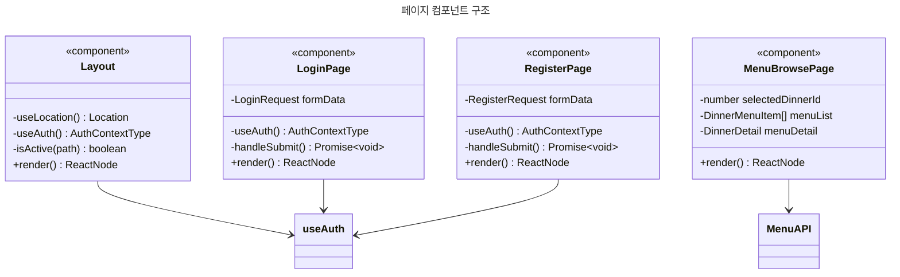

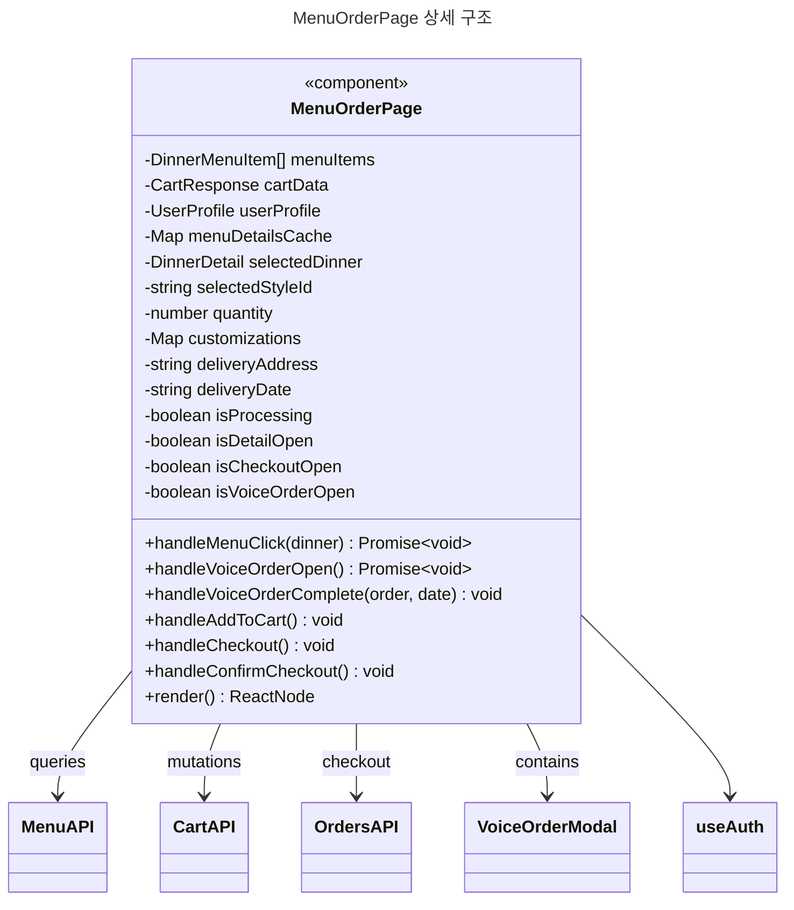

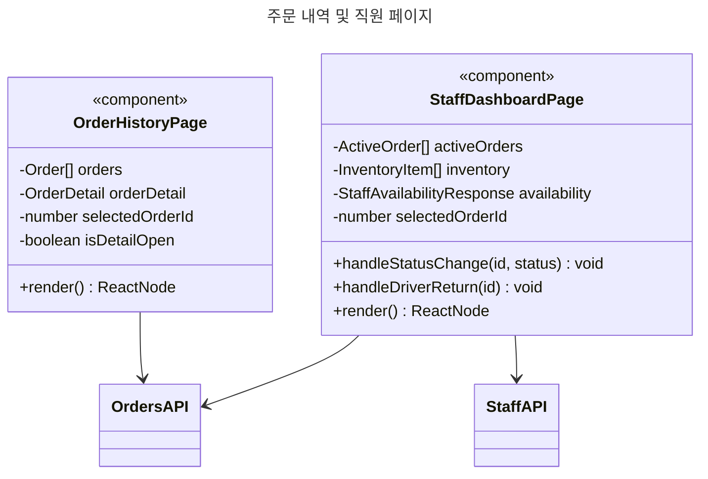

---

## 12. 전체 모듈 의존성

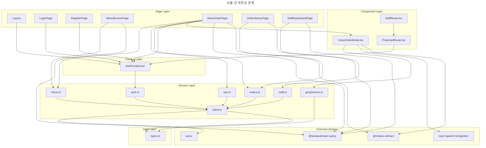

---

## 13. 음성 주문 데이터 흐름

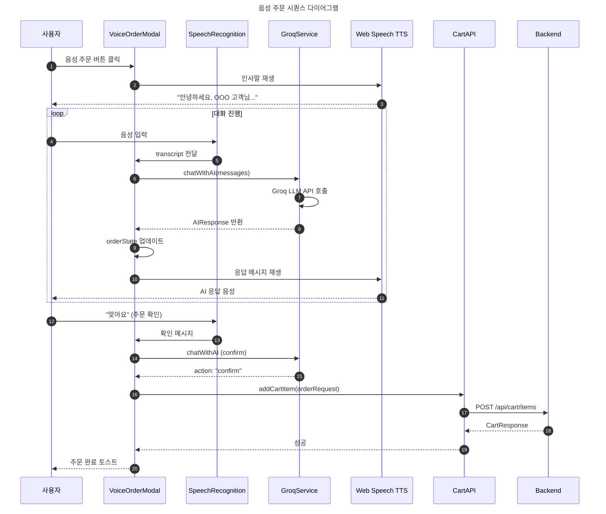

---

## 사용법

### Mermaid Live Editor
1. https://mermaid.live 접속
2. 위 코드 블록 중 원하는 다이어그램 복사
3. Editor에 붙여넣기
4. 실시간 렌더링 확인 및 PNG/SVG 다운로드

### GitHub
GitHub은 Markdown 파일의 Mermaid 코드 블록을 자동으로 렌더링합니다.

### VS Code
"Markdown Preview Mermaid Support" 또는 "Mermaid Markdown Syntax Highlighting" 확장 설치 후 미리보기 (Ctrl+Shift+V)
