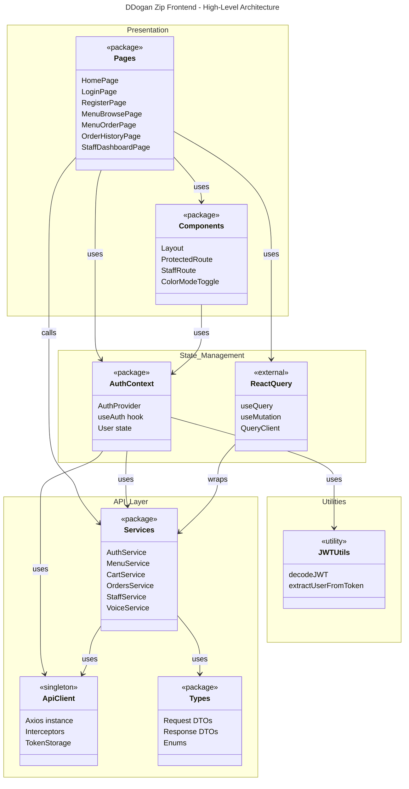
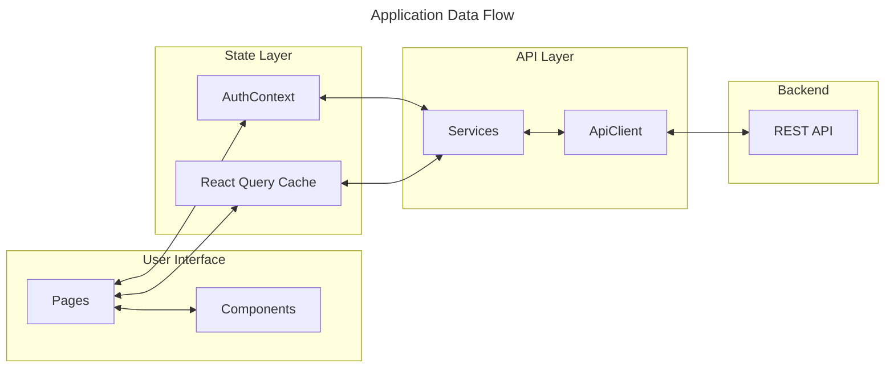
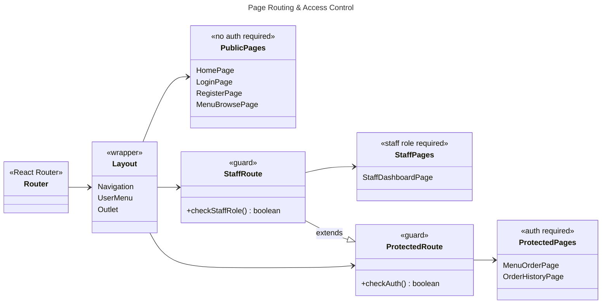
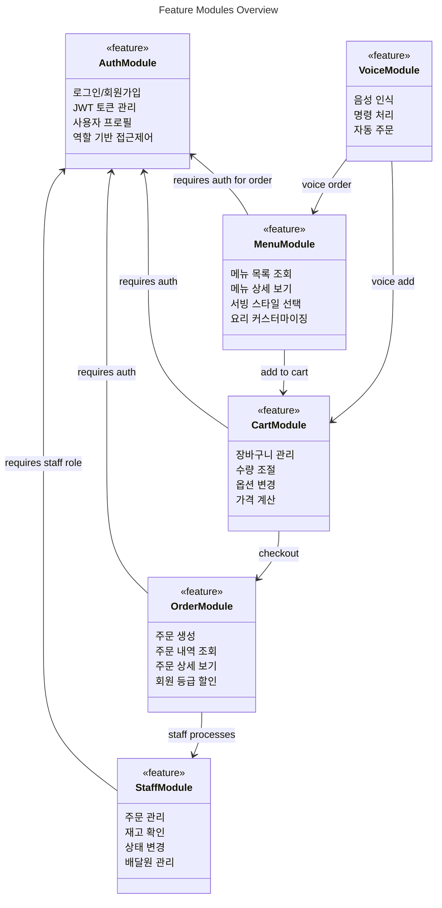

# DDogan Zip Frontend - Class Diagrams

이 문서는 DDogan Zip Frontend 애플리케이션의 클래스 다이어그램을 계층적으로 제공합니다.

> **Tip**: [Mermaid Live Editor](https://mermaid.live/)에 코드를 붙여넣으면 시각화할 수 있습니다.

---

## 다이어그램 구조

| Level | 파일 | 설명 |
|-------|------|------|
| **L1** | 이 파일 | 고수준 아키텍처 - 패키지 간 관계 |
| **L2** | [level2-auth.md](./level2-auth.md) | 인증 & 사용자 관리 |
| **L2** | [level2-menu-cart.md](./level2-menu-cart.md) | 메뉴 & 장바구니 |
| **L2** | [level2-order.md](./level2-order.md) | 주문 처리 |
| **L2** | [level2-staff.md](./level2-staff.md) | 스태프 대시보드 |

---

## Level 1: 고수준 아키텍처

전체 애플리케이션의 패키지 구조와 주요 의존성을 보여줍니다.

---

## Level 1: 데이터 흐름

사용자 인터랙션부터 백엔드 API까지의 데이터 흐름입니다.

---

## Level 1: 페이지 라우팅 & 접근 제어

---

## Level 1: 주요 기능별 모듈

---

## 상세 다이어그램 (Level 2)

각 도메인의 상세한 클래스 구조는 아래 링크에서 확인하세요:

- **[인증 & 사용자](./level2-auth.md)** - 로그인, 회원가입, JWT, 사용자 프로필
- **[메뉴 & 장바구니](./level2-menu-cart.md)** - 메뉴 조회, 커스터마이징, 장바구니
- **[주문](./level2-order.md)** - 주문 생성, 상태 관리, 할인 적용
- **[스태프](./level2-staff.md)** - 주문 처리, 재고 관리, 배달 관리
