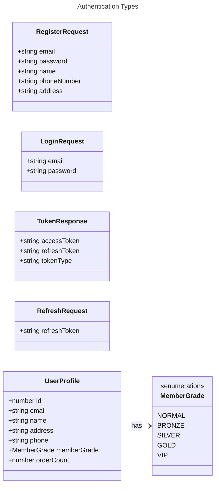
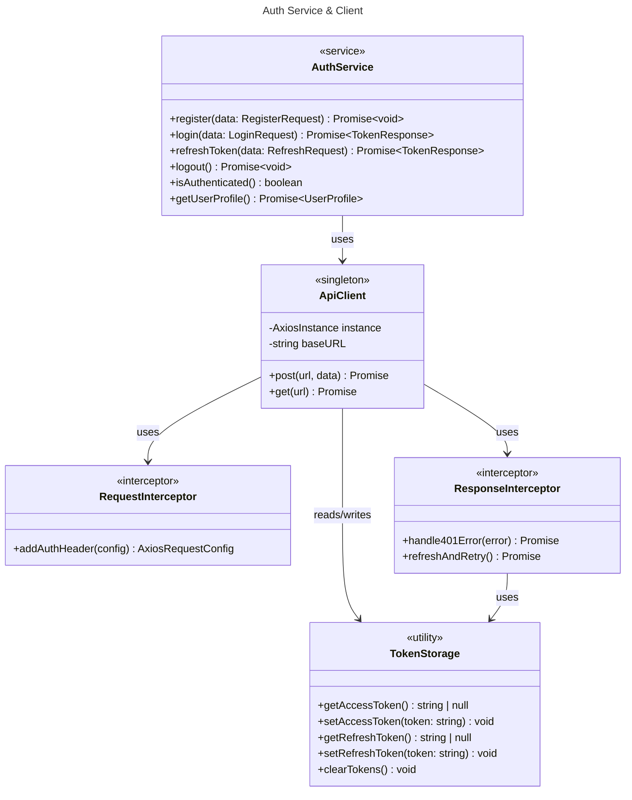
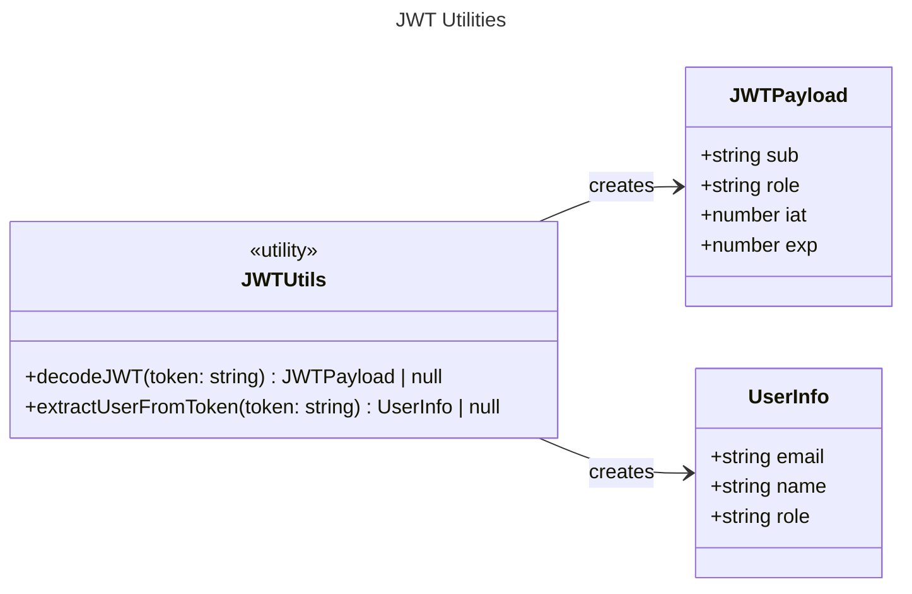
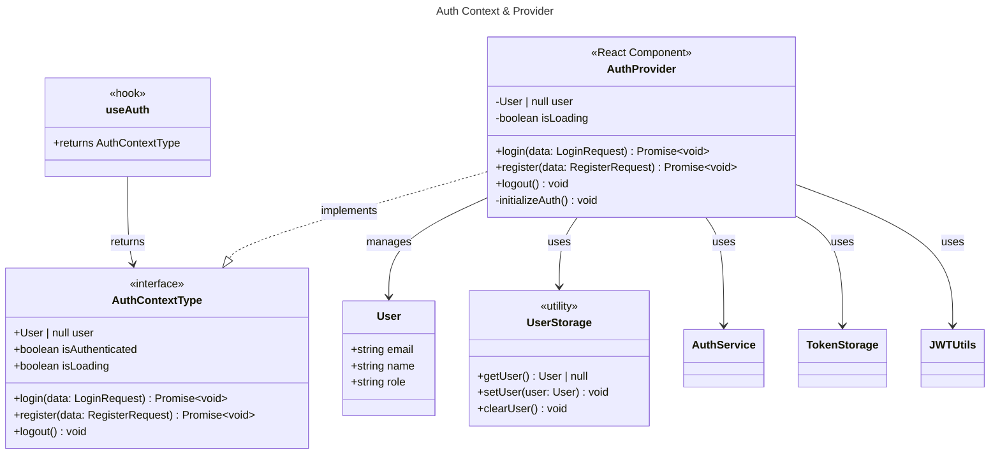
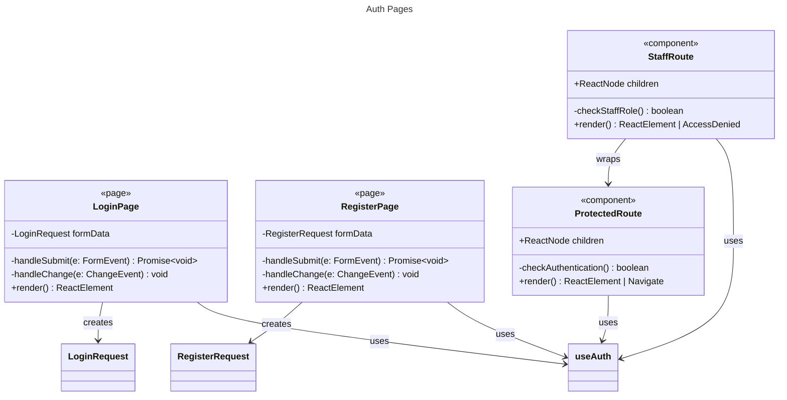
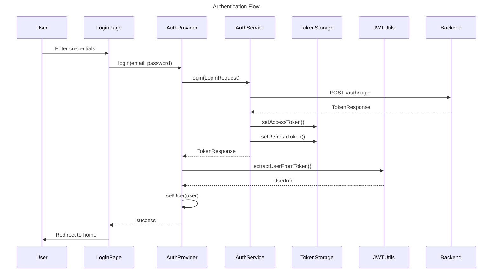
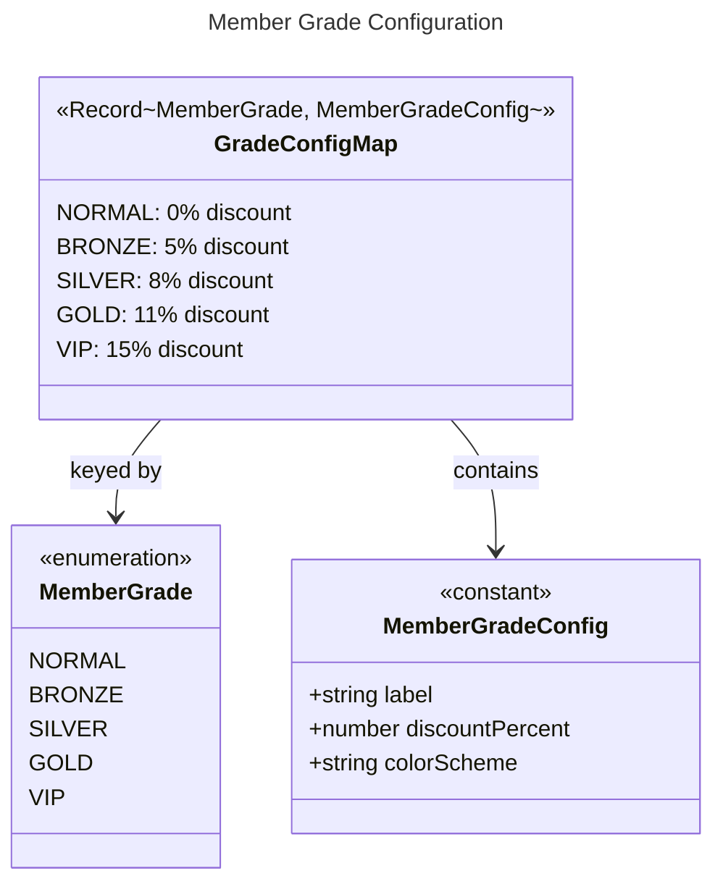

# Level 2: 인증 & 사용자 관리

[< 목차로 돌아가기](./README.md)

---

## 개요

인증, 사용자 관리, JWT 토큰 처리와 관련된 클래스들입니다.

---

## 인증 타입 (API Types)

---

## 인증 서비스

---

## JWT 유틸리티

---

## Auth Context (상태 관리)

---

## 인증 관련 페이지

---

## 전체 인증 흐름

---

## 회원 등급 설정

