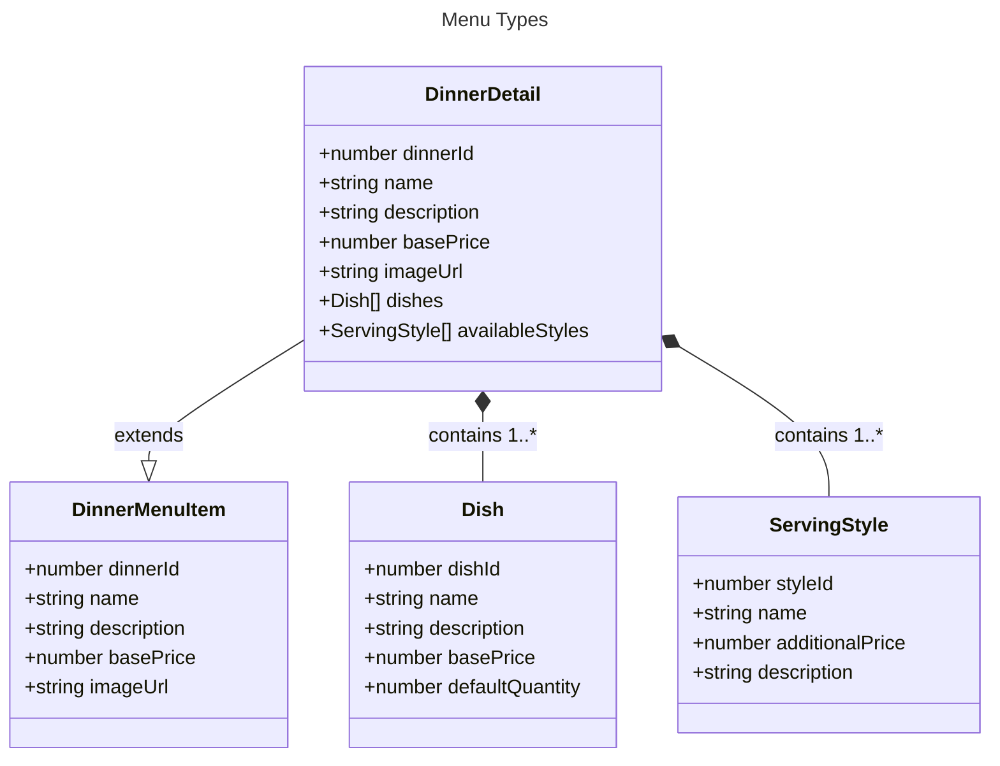
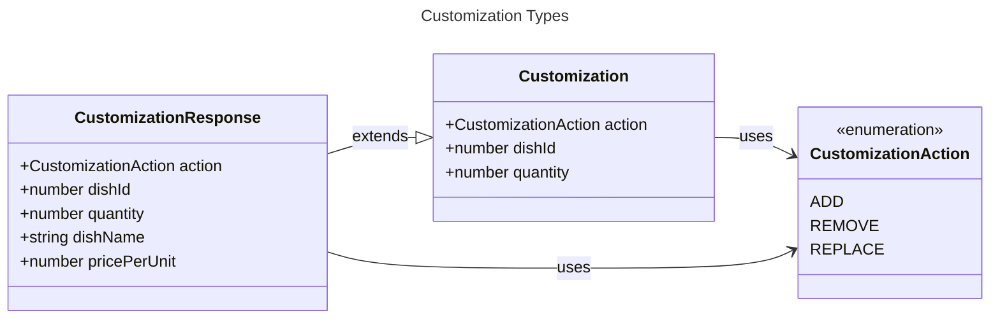
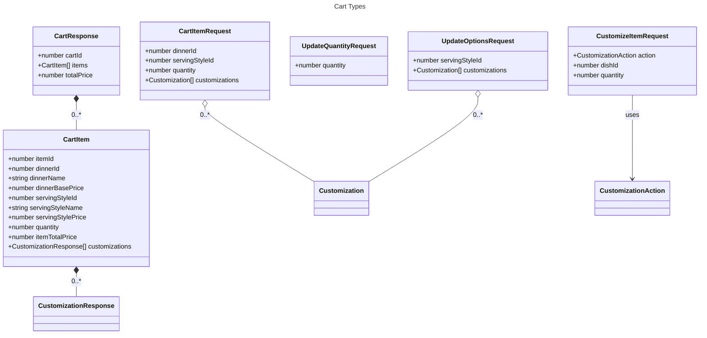
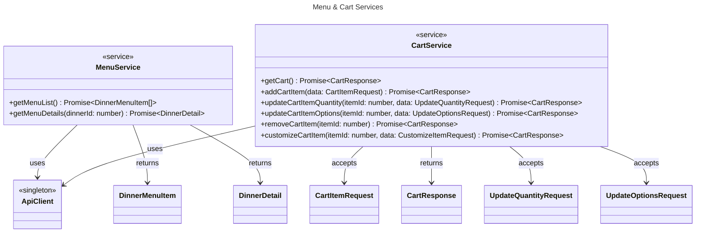
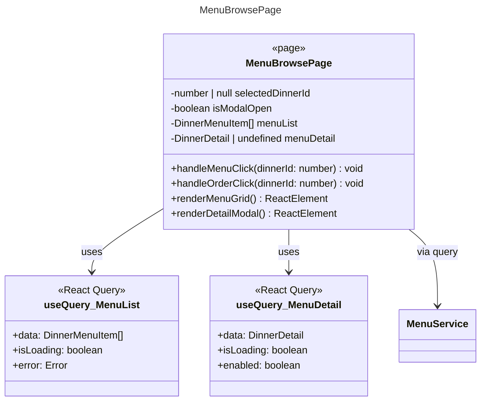
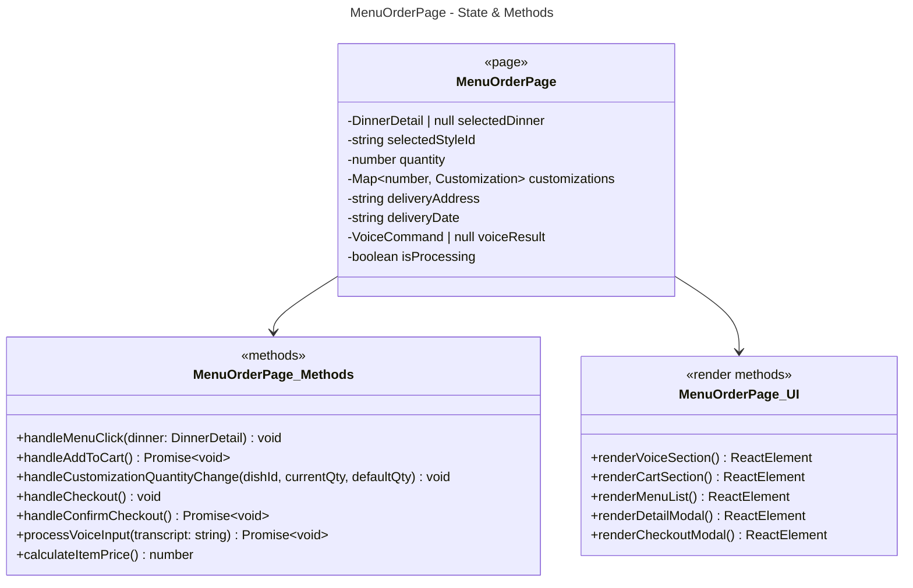
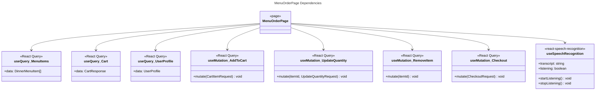
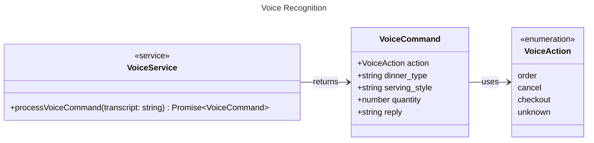
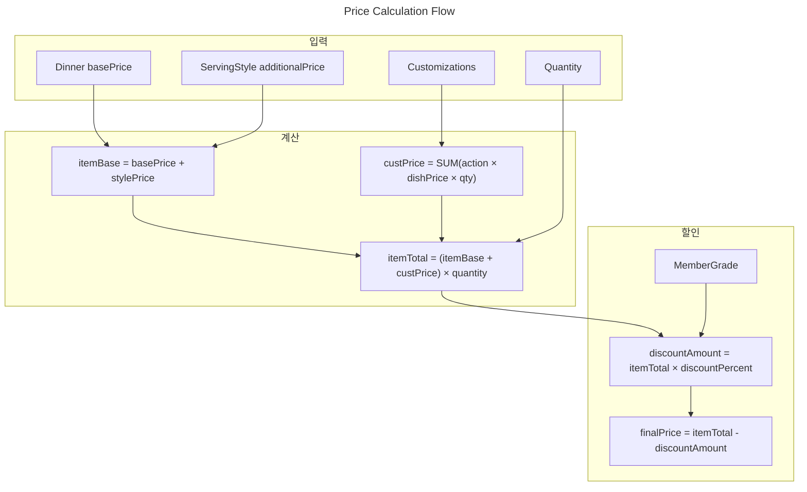

# Level 2: 메뉴 & 장바구니

[< 목차로 돌아가기](./README.md)

---

## 개요

메뉴 조회, 커스터마이징, 장바구니 관리와 관련된 클래스들입니다.

---

## 메뉴 타입

---

## 커스터마이징 타입

---

## 장바구니 타입

---

## 메뉴 & 장바구니 서비스

---

## 메뉴 브라우즈 페이지

---

## 메뉴 주문 페이지

---

## 메뉴 주문 페이지 - 의존성

---

## 음성 인식

---

## 가격 계산 로직

