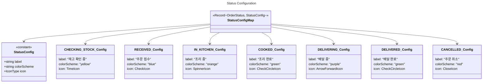

# Level 2: 주문 처리

[< 목차로 돌아가기](./README.md)

---

## 개요

주문 생성, 주문 상태 관리, 주문 내역 조회와 관련된 클래스들입니다.

---

## 주문 상태 Enum

---

## 주문 타입

---

## 주문 서비스

---

## 주문 내역 페이지

---

## 주문 상태 설정

---

## 주문 생성 흐름

---

## 할인 계산

---

## 주문 상세 정보 구조

