# Level 2: 스태프 대시보드

[< 목차로 돌아가기](./README.md)

---

## 개요

스태프 전용 기능: 주문 관리, 재고 확인, 상태 변경, 배달원 관리와 관련된 클래스들입니다.

---

## 스태프 타입

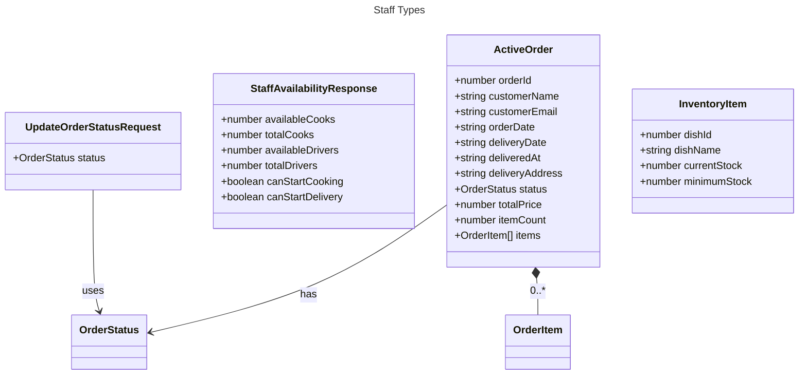

---

## 스태프 서비스

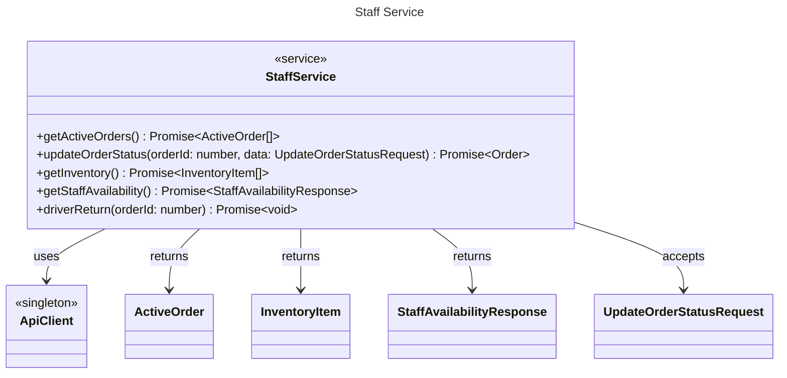

---

## 스태프 대시보드 페이지 - 상태

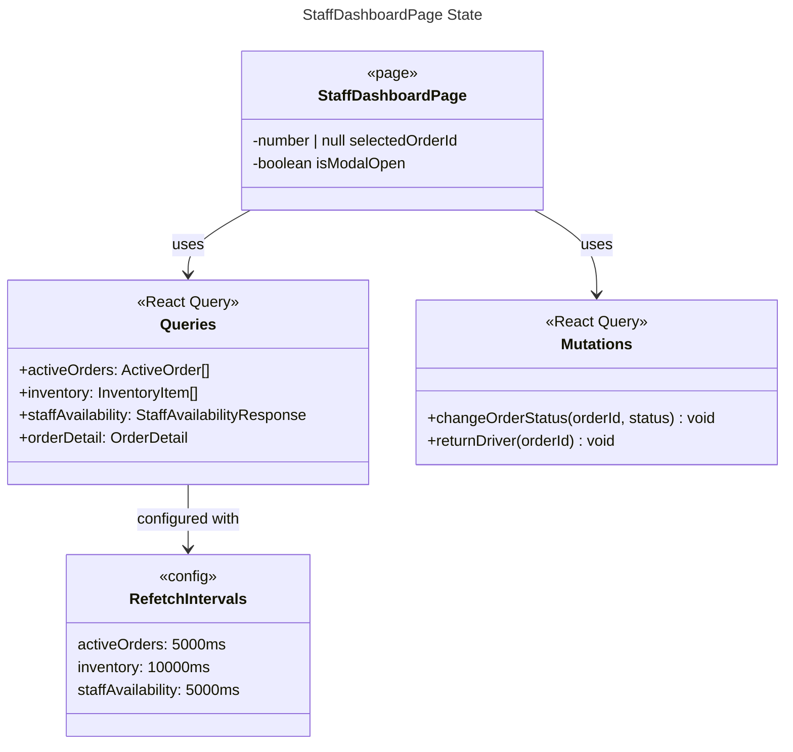

---

## 스태프 대시보드 페이지 - 메서드

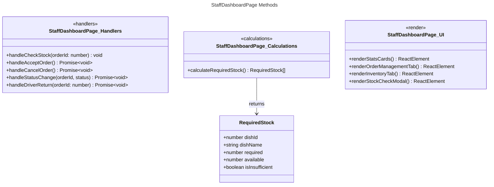

---

## 주문 상태 전이

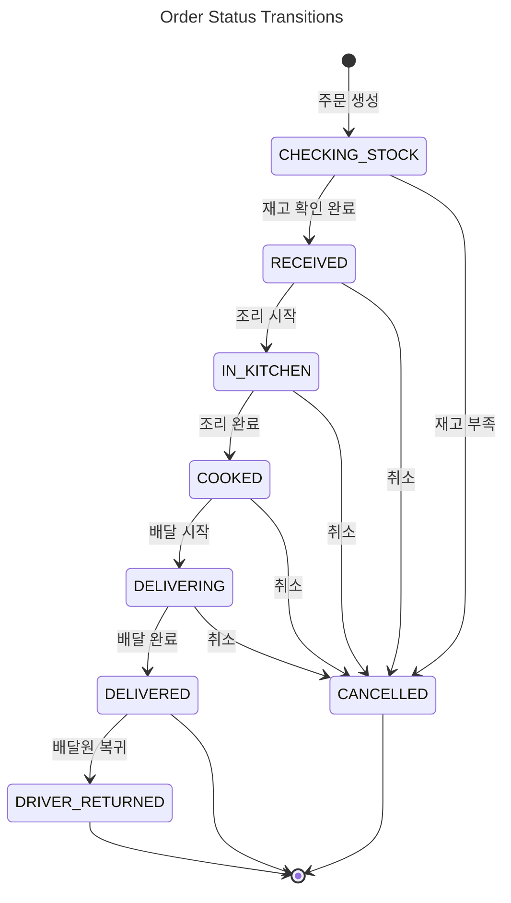

---

## 다음 상태 맵핑

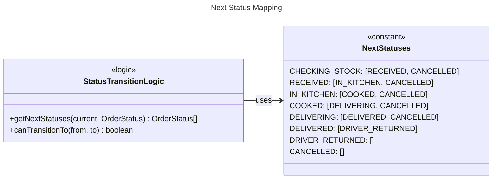

---

## 재고 확인 로직

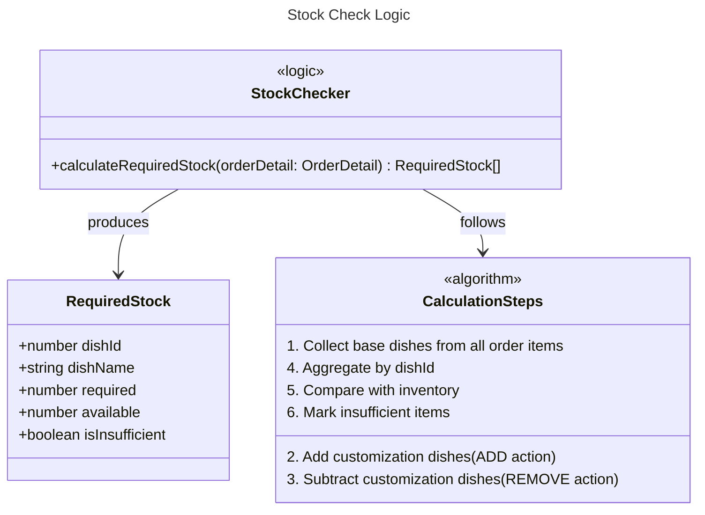

---

## 재고 확인 흐름

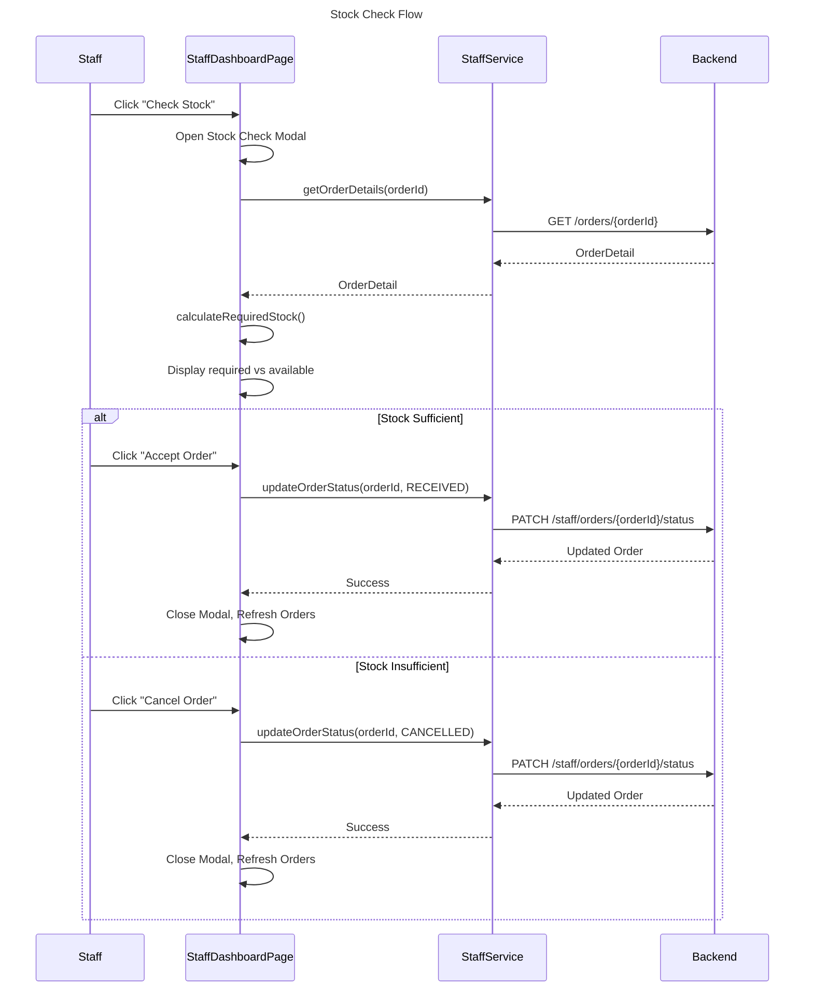

---

## 대시보드 UI 구조

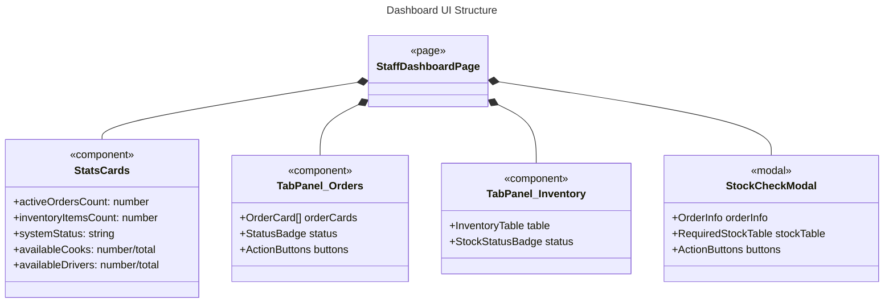

---

## 스태프 가용성 체크

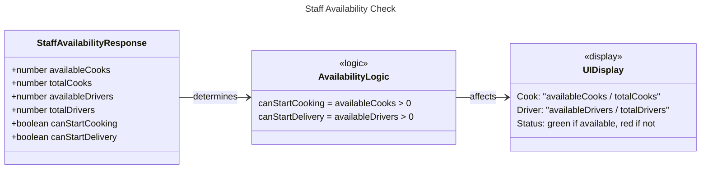

---

## 배달원 복귀 처리

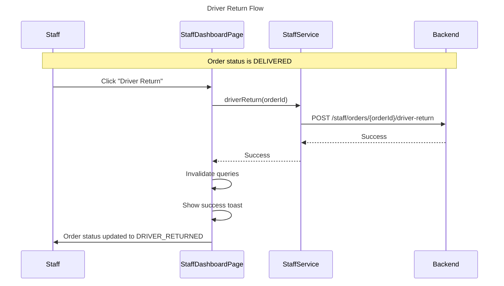
