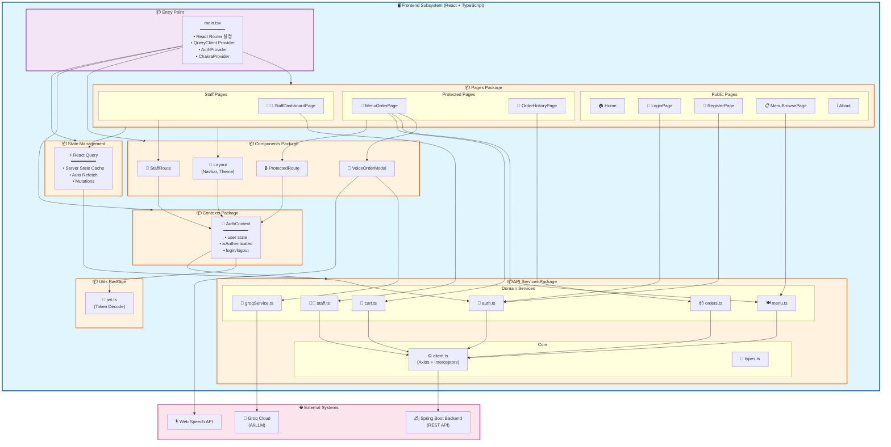
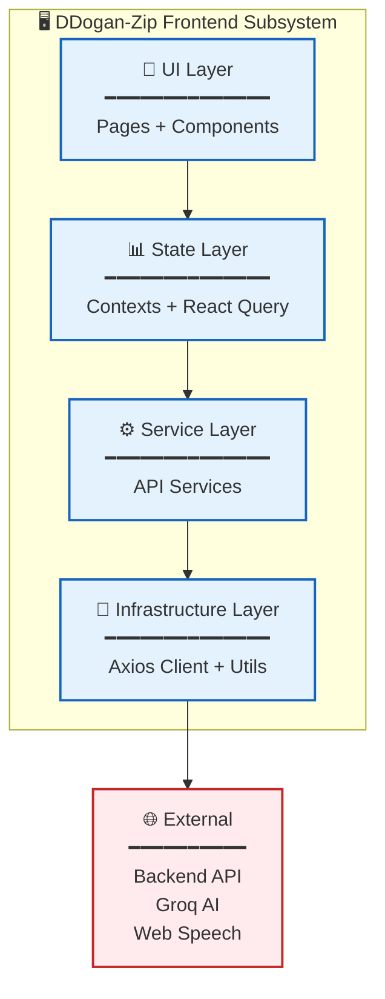
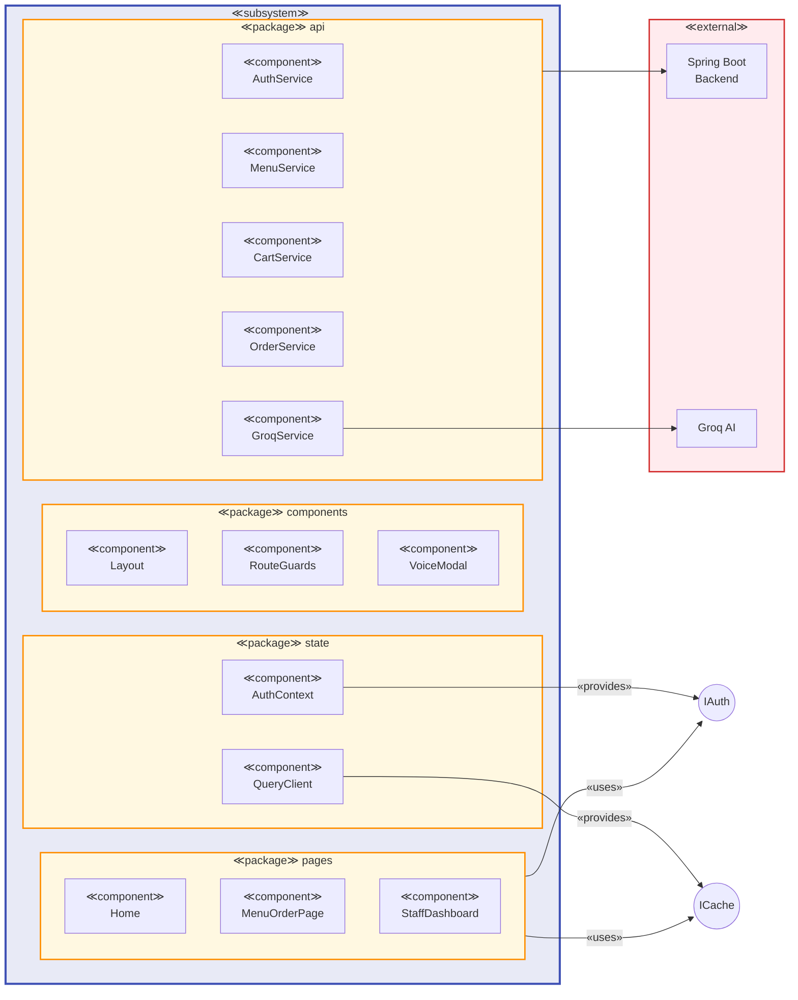

# 컴포넌트 다이어그램 (Component Diagram)

## 프론트엔드 서브시스템 구조

프론트엔드는 **하나의 서브시스템**이며, 그 안에 여러 **패키지(Package)**들이 존재합니다.

---

## 패키지별 상세 설명

### 1. Entry Point (main.tsx)
애플리케이션 진입점으로, 모든 Provider들을 설정하고 라우팅을 구성합니다.

### 2. Pages Package
화면 단위 컴포넌트들로, 3가지 접근 레벨로 구분됩니다:
- **Public**: 인증 없이 접근 가능
- **Protected**: 로그인 필요
- **Staff**: STAFF 권한 필요

### 3. Components Package
재사용 가능한 UI 컴포넌트들:
- `Layout`: 공통 레이아웃 (Navbar, Theme Toggle)
- `ProtectedRoute`: 인증 가드
- `StaffRoute`: 권한 가드
- `VoiceOrderModal`: AI 음성 주문 모달

### 4. Contexts Package
React Context 기반 전역 상태 관리

### 5. API Services Package
백엔드 통신 계층:
- **Core**: Axios 클라이언트, 타입 정의
- **Domain Services**: 도메인별 API 호출

### 6. Utils Package
공통 유틸리티 함수들

### 7. State Management (React Query)
서버 상태 캐싱 및 동기화

---

## 간소화된 계층 다이어그램

---

## UML 표기법 컴포넌트 다이어그램

---

## 의존성 요약

| From | To | 관계 |
|------|-----|------|
| Pages | Components | uses |
| Pages | API Services | uses |
| Pages | Contexts | uses |
| Components | Contexts | uses |
| Contexts | API Services | uses |
| Contexts | Utils | uses |
| API Services | Client | uses |
| Client | Backend | HTTP |
| GroqService | Groq Cloud | HTTP |
| VoiceModal | Web Speech API | uses |

---

## 결론

**프론트엔드는 단일 서브시스템(Subsystem)**이며, 내부에 다음 패키지들을 포함합니다:

1. **pages** - 9개의 페이지 컴포넌트
2. **components** - 4개의 재사용 컴포넌트
3. **contexts** - 1개의 인증 컨텍스트
4. **api** - 8개의 서비스 모듈
5. **utils** - 유틸리티 함수들

이 구조는 **계층형 아키텍처(Layered Architecture)**를 따르며, 각 계층은 바로 아래 계층에만 의존합니다.
