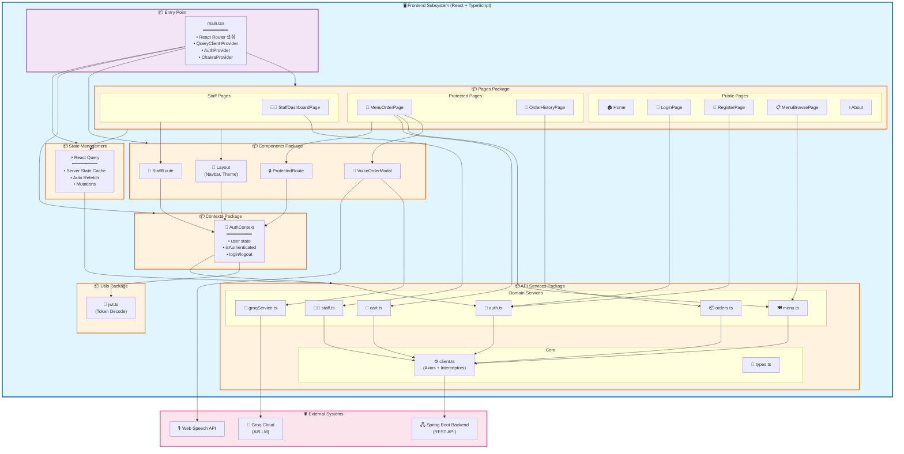
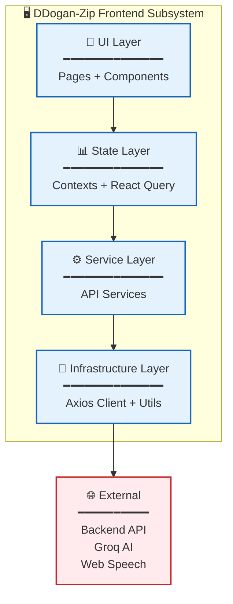
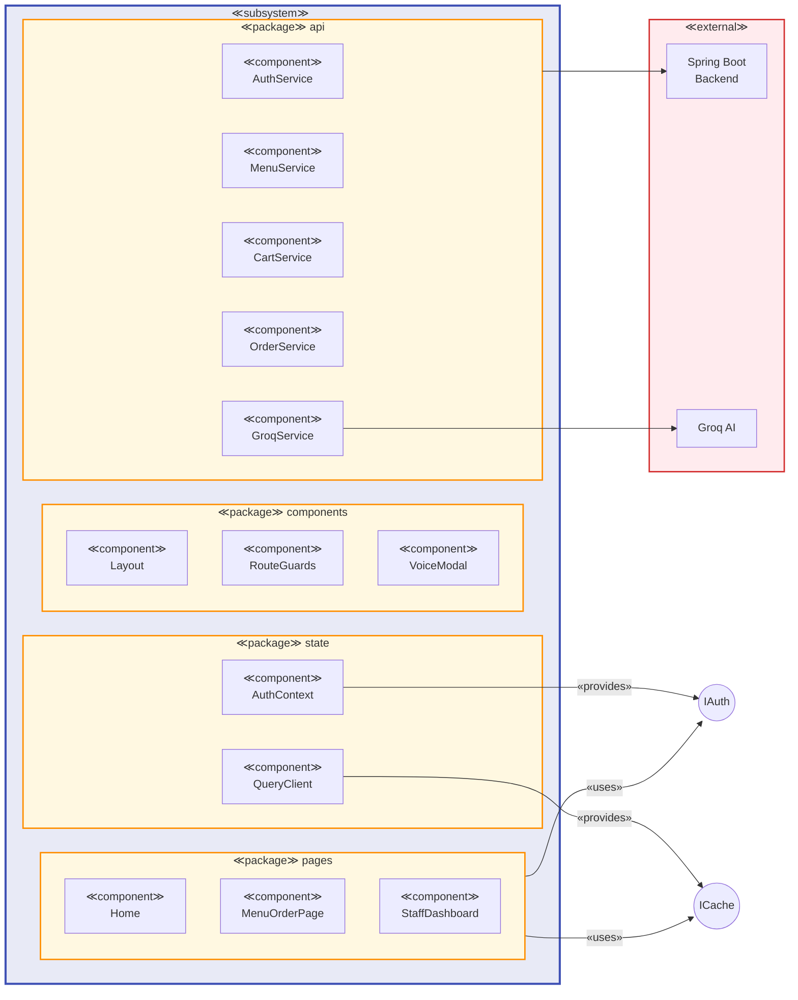
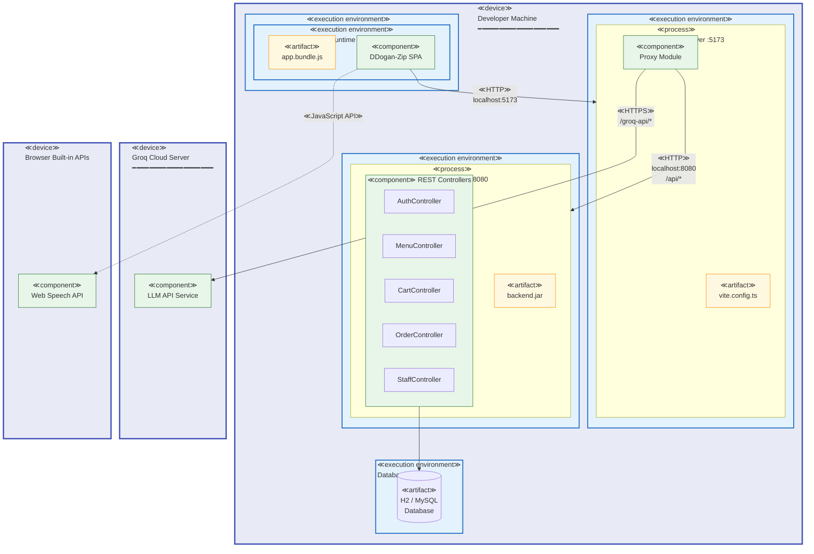
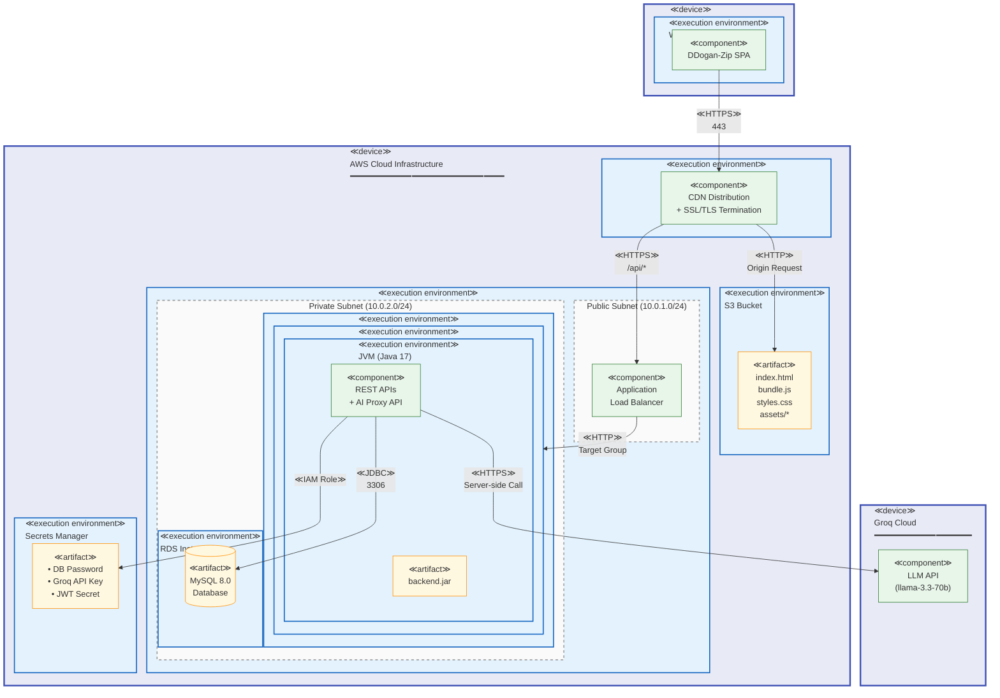
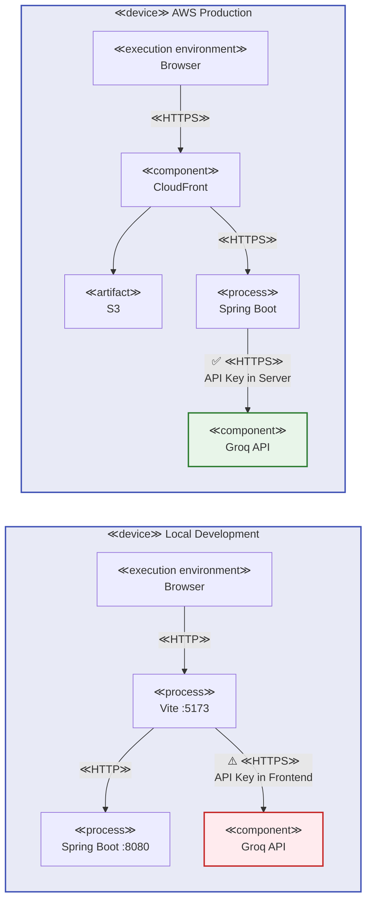

# 컴포넌트 다이어그램 (Component Diagram)

## 프론트엔드 서브시스템 구조

프론트엔드는 **하나의 서브시스템**이며, 그 안에 여러 **패키지(Package)**들이 존재합니다.



---

## 패키지별 상세 설명

### 1. Entry Point (main.tsx)
애플리케이션 진입점으로, 모든 Provider들을 설정하고 라우팅을 구성합니다.

### 2. Pages Package
화면 단위 컴포넌트들로, 3가지 접근 레벨로 구분됩니다:
- **Public**: 인증 없이 접근 가능
- **Protected**: 로그인 필요
- **Staff**: STAFF 권한 필요

### 3. Components Package
재사용 가능한 UI 컴포넌트들:
- `Layout`: 공통 레이아웃 (Navbar, Theme Toggle)
- `ProtectedRoute`: 인증 가드
- `StaffRoute`: 권한 가드
- `VoiceOrderModal`: AI 음성 주문 모달

### 4. Contexts Package
React Context 기반 전역 상태 관리

### 5. API Services Package
백엔드 통신 계층:
- **Core**: Axios 클라이언트, 타입 정의
- **Domain Services**: 도메인별 API 호출

### 6. Utils Package
공통 유틸리티 함수들

### 7. State Management (React Query)
서버 상태 캐싱 및 동기화

---

## 간소화된 계층 다이어그램



---

## UML 표기법 컴포넌트 다이어그램



---

## 의존성 요약

| From | To | 관계 |
|------|-----|------|
| Pages | Components | uses |
| Pages | API Services | uses |
| Pages | Contexts | uses |
| Components | Contexts | uses |
| Contexts | API Services | uses |
| Contexts | Utils | uses |
| API Services | Client | uses |
| Client | Backend | HTTP |
| GroqService | Groq Cloud | HTTP |
| VoiceModal | Web Speech API | uses |

---

## 결론

**프론트엔드는 단일 서브시스템(Subsystem)**이며, 내부에 다음 패키지들을 포함합니다:

1. **pages** - 9개의 페이지 컴포넌트
2. **components** - 4개의 재사용 컴포넌트
3. **contexts** - 1개의 인증 컨텍스트
4. **api** - 8개의 서비스 모듈
5. **utils** - 유틸리티 함수들

이 구조는 **계층형 아키텍처(Layered Architecture)**를 따르며, 각 계층은 바로 아래 계층에만 의존합니다.

---

# 환경별 배치 다이어그램 (Deployment Diagram)

UML 2.0 배치 다이어그램 표기법을 사용하여 시스템의 물리적 배포 구조를 나타냅니다.

## 1. 로컬 개발/테스트 환경 (시연용)

개발 및 시연 시 사용하는 환경입니다.



### 로컬 환경 노드 명세

| 노드 (Node) | 타입 | 포트 | 배포된 아티팩트 |
|------------|------|------|----------------|
| Developer Machine | ≪device≫ | - | 전체 개발 환경 |
| Web Browser | ≪execution environment≫ | - | app.bundle.js |
| Vite Dev Server | ≪process≫ | 5173 | vite.config.ts |
| Spring Boot | ≪process≫ | 8080 | backend.jar |
| Database | ≪execution environment≫ | 3306 | H2/MySQL |
| Groq Cloud | ≪device≫ | 443 | LLM Service |

### 통신 경로 (Communication Path)

| From | To | 프로토콜 | 설명 |
|------|-----|---------|------|
| Browser | Vite | ≪HTTP≫ | HMR, 정적 파일 요청 |
| Vite Proxy | Spring Boot | ≪HTTP≫ | /api/* 프록시 |
| Vite Proxy | Groq Cloud | ≪HTTPS≫ | /groq-api/* 프록시 |
| Spring Boot | Database | ≪JDBC≫ | 데이터 영속화 |

---

## 2. AWS 프로덕션 환경 (이상적인 구조)

실제 서비스 배포 시 권장되는 아키텍처입니다.



### AWS 환경 노드 명세

| 노드 (Node) | AWS 서비스 | 타입 | 역할 |
|------------|-----------|------|------|
| CloudFront Edge | CloudFront | ≪execution environment≫ | CDN, HTTPS, 캐싱 |
| S3 Bucket | S3 | ≪execution environment≫ | 정적 파일 호스팅 |
| ALB | Application Load Balancer | ≪component≫ | 로드밸런싱, 라우팅 |
| ECS Cluster | ECS Fargate / EC2 | ≪execution environment≫ | 컨테이너 오케스트레이션 |
| Docker Container | - | ≪execution environment≫ | 애플리케이션 격리 |
| RDS Instance | RDS MySQL | ≪execution environment≫ | 관계형 데이터베이스 |
| Secrets Manager | Secrets Manager | ≪execution environment≫ | 비밀 정보 관리 |

### 배포 아티팩트 (Deployment Artifact)

| 아티팩트 | 위치 | 설명 |
|---------|------|------|
| index.html, bundle.js | S3 Bucket | 프론트엔드 정적 파일 |
| backend.jar | Docker Container | Spring Boot 애플리케이션 |
| MySQL Database | RDS Instance | 영구 데이터 저장소 |

---

## 3. 환경별 비교 다이어그램



## 4. 환경별 비교표

| 항목 | 로컬 개발 환경 | AWS 프로덕션 환경 |
|------|---------------|------------------|
| **프론트엔드 서버** | Vite Dev Server (:5173) | S3 + CloudFront (서버리스) |
| **백엔드 서버** | Spring Boot (:8080) | ECS/EC2 + ALB |
| **데이터베이스** | H2 (in-memory) / 로컬 MySQL | RDS MySQL |
| **AI API 호출** | Vite 프록시 경유 | Spring Boot에서 직접 호출 |
| **API 키 위치** | 프론트엔드 환경변수 (⚠️) | Secrets Manager (✅) |
| **HTTPS** | ❌ HTTP | ✅ HTTPS (ACM 인증서) |
| **확장성** | 단일 머신 | Auto Scaling 가능 |
| **비용** | 💰 무료 | 💰💰💰 유료 |

---

## 5. 프로덕션 배포 시 필요한 변경사항

현재 코드를 AWS에 배포하려면 다음 수정이 필요합니다:

### 5.1 Groq API 호출을 백엔드로 이동

```
현재 (보안 취약):
┌──────────┐    ┌──────────┐
│ Frontend │───▶│ Groq API │  ← API 키 노출!
└──────────┘    └──────────┘

수정 후 (안전):
┌──────────┐    ┌──────────┐    ┌──────────┐
│ Frontend │───▶│ Backend  │───▶│ Groq API │
└──────────┘    └──────────┘    └──────────┘
                     ↑
              API 키는 여기만!
```

### 5.2 환경 변수 분리

```bash
# 로컬 (.env.local)
VITE_API_BASE_URL=http://localhost:8080
VITE_GROQ_API_KEY=sk-xxxxx  # 개발용만!

# 프로덕션 (.env.production)
VITE_API_BASE_URL=https://api.ddoganzip.com
# GROQ_API_KEY는 프론트에 없음! 백엔드에서 관리
```

### 5.3 백엔드에 AI 프록시 엔드포인트 추가

```java
// Spring Boot Controller (추가 필요)
@RestController
@RequestMapping("/api/ai")
public class AIController {

    @Value("${groq.api.key}")  // Secrets Manager에서 주입
    private String groqApiKey;

    @PostMapping("/chat")
    public AIResponse chat(@RequestBody ChatRequest request) {
        // Groq API 호출 (API 키는 서버에만 존재)
    }
}
```

---

## 6. 시연 환경 체크리스트

로컬에서 시연할 때 확인사항:

- [ ] Spring Boot 서버 실행 (`./gradlew bootRun` on :8080)
- [ ] Vite Dev Server 실행 (`npm run dev` on :5173)
- [ ] `.env` 파일에 `VITE_GROQ_API_KEY` 설정
- [ ] 데이터베이스 연결 확인
- [ ] 브라우저에서 `http://localhost:5173` 접속
