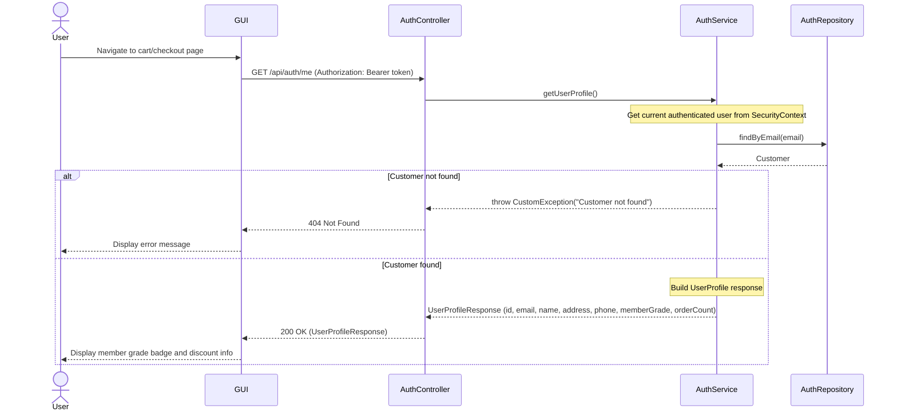
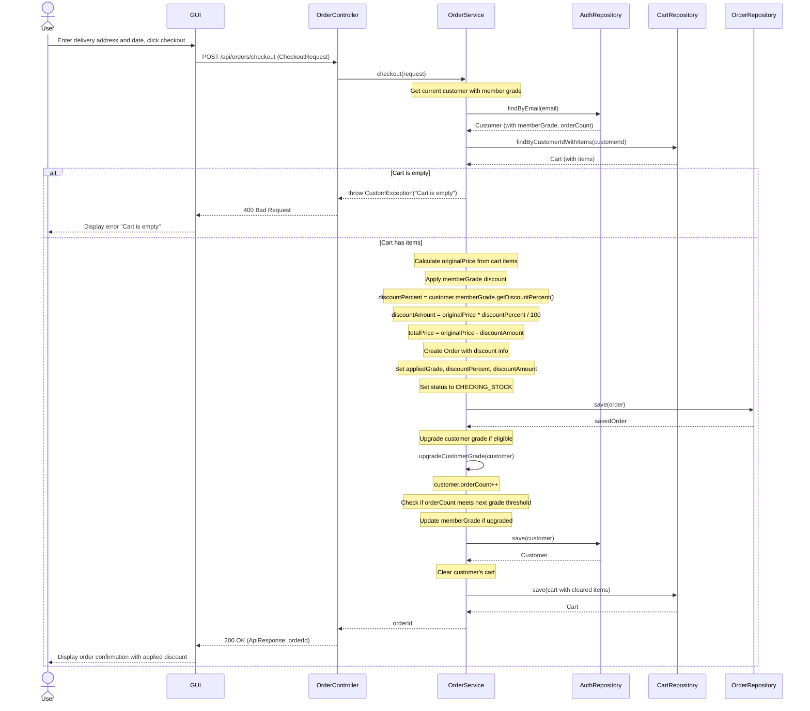
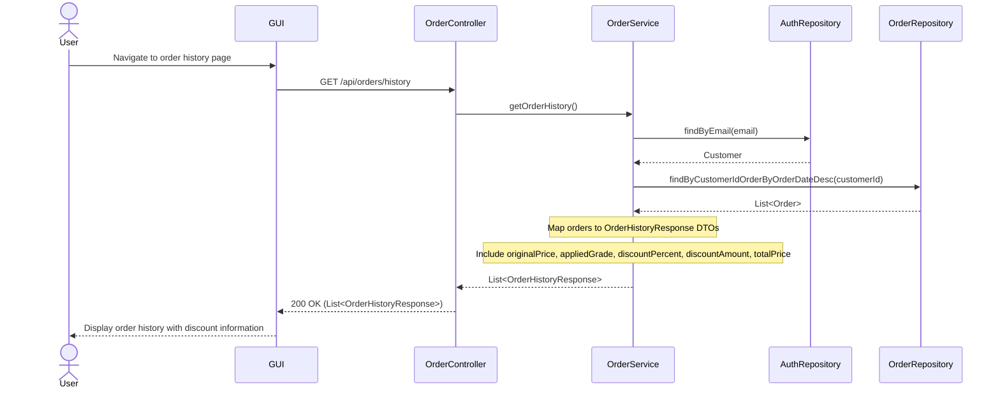
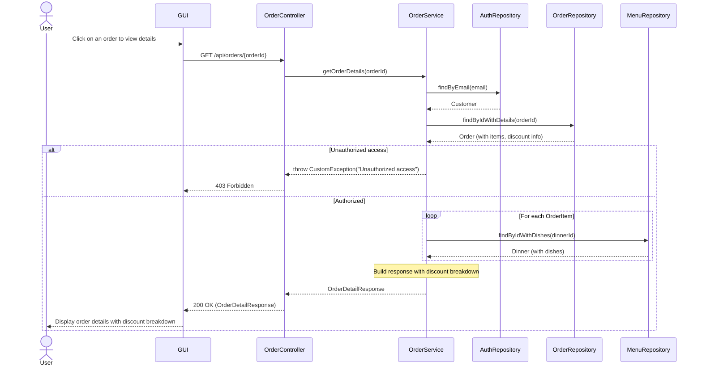
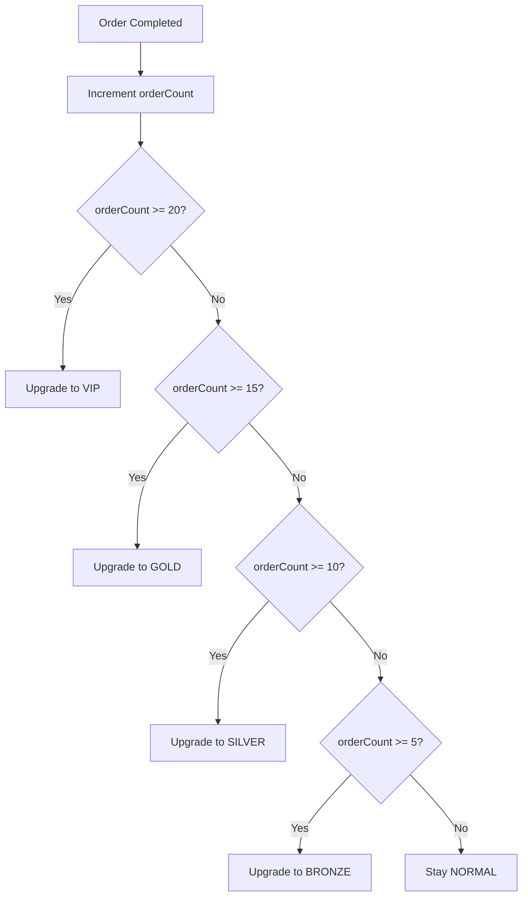

# Member Grade Discount - Sequence Diagrams

This document contains sequence diagrams for the member grade discount feature.

---

## 1. Get User Profile (Member Grade Info)



### Request
- **Method:** GET
- **Endpoint:** `/api/auth/me`
- **Headers:** `Authorization: Bearer {accessToken}`
- **Body:** None

### Response
```json
{
  "id": 1,
  "email": "user@example.com",
  "name": "John Doe",
  "address": "123 Main St",
  "phone": "010-1234-5678",
  "memberGrade": "SILVER",
  "orderCount": 12
}
```

---

## 2. Checkout with Member Grade Discount



---

## 3. View Order History with Discount Info



### OrderHistoryResponse Fields
| Field | Type | Description |
|-------|------|-------------|
| orderId | number | Order ID |
| orderDate | string | Order creation timestamp (ISO 8601) |
| deliveryDate | string? | Requested delivery timestamp |
| deliveredAt | string? | Actual delivery timestamp |
| deliveryAddress | string | Delivery address |
| status | string | Order status |
| originalPrice | number | Price before discount |
| appliedGrade | string | Member grade applied at checkout |
| discountPercent | number | Discount percentage (0-15) |
| discountAmount | number | Discount amount in KRW |
| totalPrice | number | Final price after discount |
| itemCount | number | Number of items in order |

---

## 4. View Order Details with Discount Info



---

## Member Grade System

### Grade Thresholds
| Grade | Discount | Required Orders |
|-------|----------|-----------------|
| NORMAL | 0% | 0 |
| BRONZE | 5% | 5 |
| SILVER | 8% | 10 |
| GOLD | 11% | 15 |
| VIP | 15% | 20 |

### Grade Upgrade Logic


---

## Discount Calculation Example

```
Customer: john@example.com
Current Grade: SILVER (8% discount)
Order Count: 12

Cart Items:
- French Dinner (48,000 KRW) + Grand Style (15,000 KRW) x 2 = 126,000 KRW

Calculation:
- originalPrice: 126,000 KRW
- discountPercent: 8%
- discountAmount: 126,000 × 0.08 = 10,080 KRW
- totalPrice: 126,000 - 10,080 = 115,920 KRW

After Order:
- orderCount: 13 (still SILVER, need 15 for GOLD)
```

---

## API Endpoints Summary

| Method | Endpoint | Description |
|--------|----------|-------------|
| GET | /api/auth/me | Get current user profile with member grade |
| POST | /api/orders/checkout | Create order with automatic discount |
| GET | /api/orders/history | Get order history with discount info |
| GET | /api/orders/{orderId} | Get order details with discount breakdown |

---

## Entity Changes

### Customer Entity
```java
@Entity
public class Customer {
    // ... existing fields ...

    @Enumerated(EnumType.STRING)
    private MemberGrade memberGrade = MemberGrade.NORMAL;

    private Integer orderCount = 0;
}
```

### Order Entity
```java
@Entity
public class Order {
    // ... existing fields ...

    private Integer originalPrice;

    @Enumerated(EnumType.STRING)
    private MemberGrade appliedGrade;

    private Integer discountPercent;
    private Integer discountAmount;
    private Integer totalPrice;
}
```

### MemberGrade Enum
```java
public enum MemberGrade {
    NORMAL(0, 0),
    BRONZE(5, 5),
    SILVER(8, 10),
    GOLD(11, 15),
    VIP(15, 20);

    private final int discountPercent;
    private final int requiredOrders;

    public static MemberGrade calculateGrade(int orderCount) {
        for (MemberGrade grade : values()) {
            if (orderCount < grade.requiredOrders) {
                return values()[grade.ordinal() - 1];
            }
        }
        return VIP;
    }

    public int calculateDiscount(int originalPrice) {
        return originalPrice * discountPercent / 100;
    }
}
```
