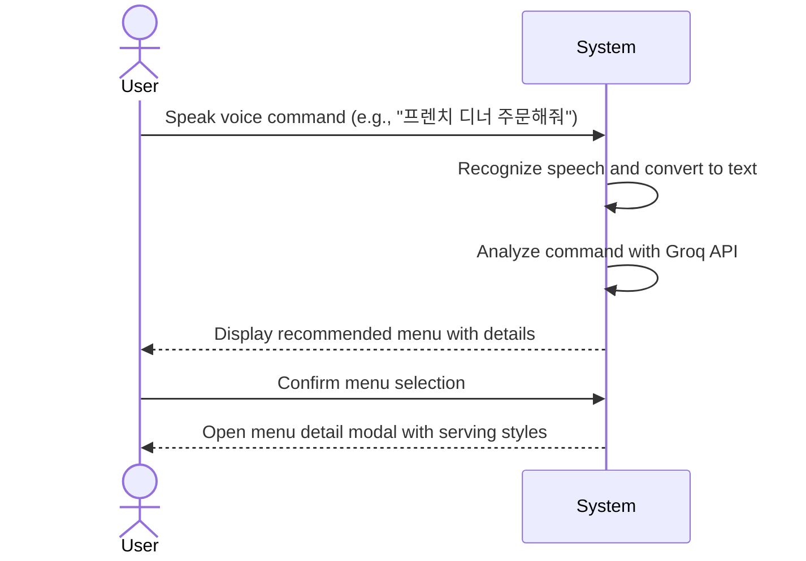
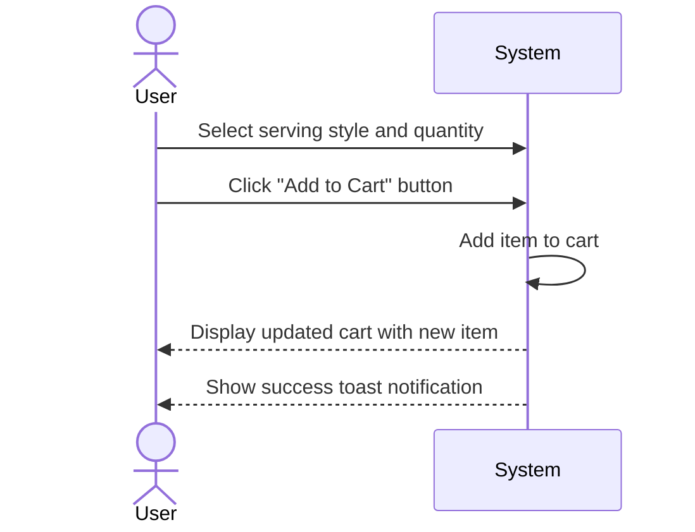
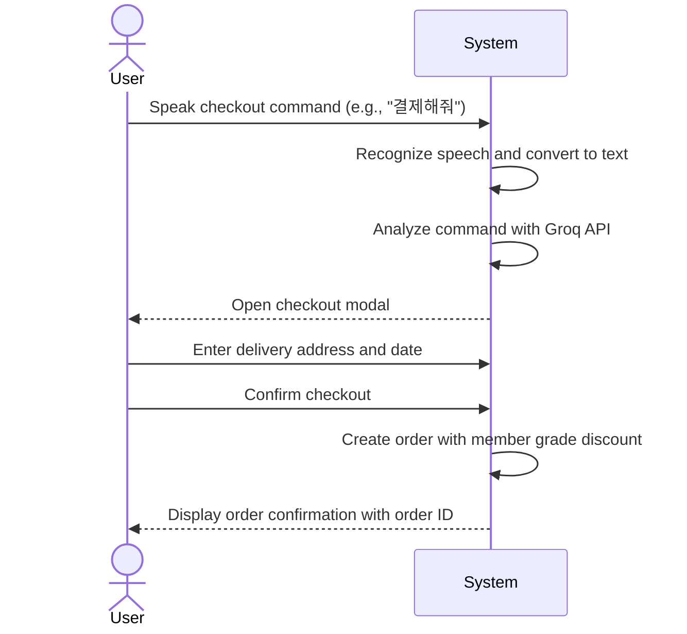
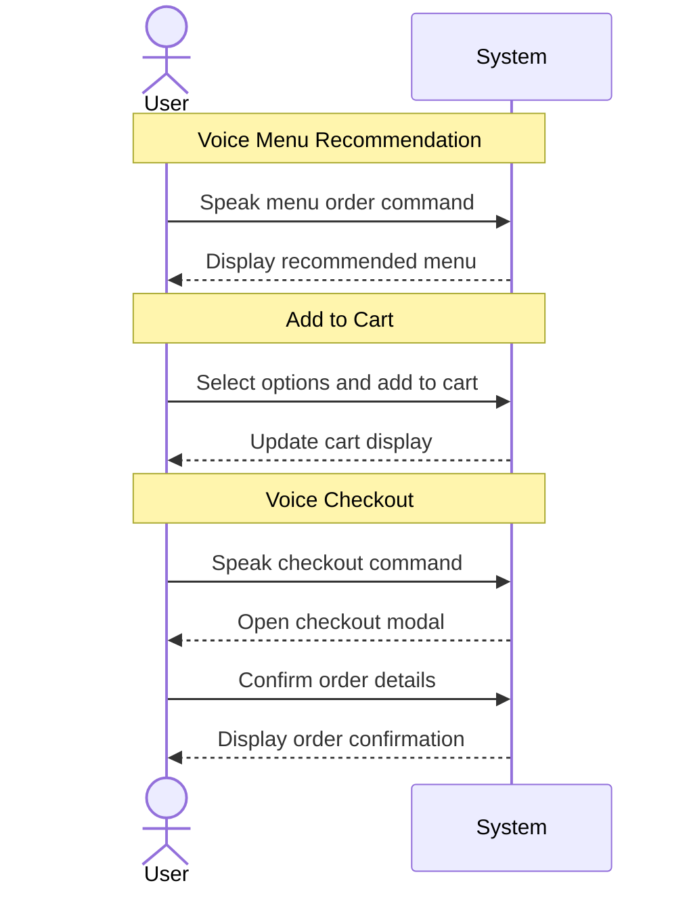
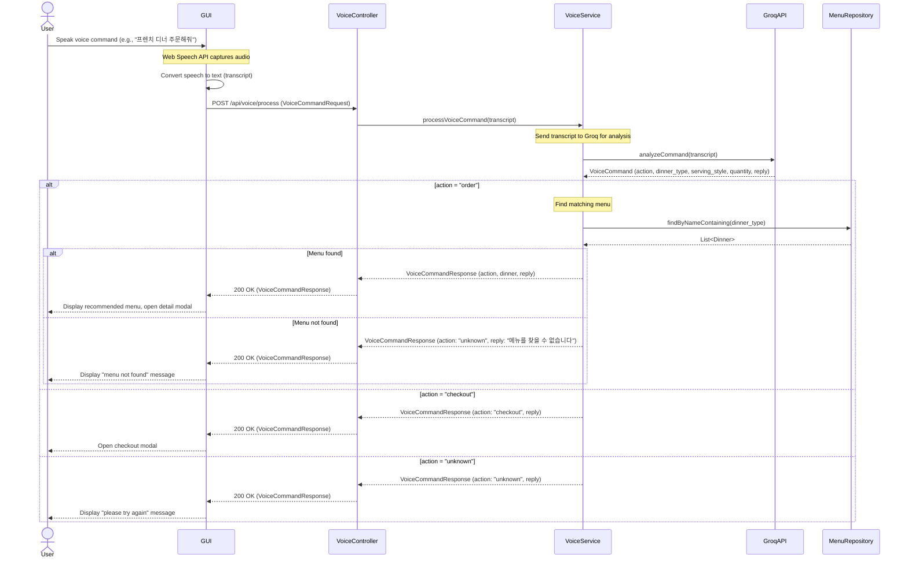
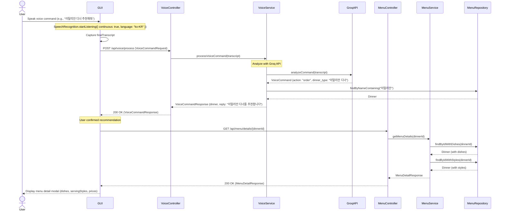
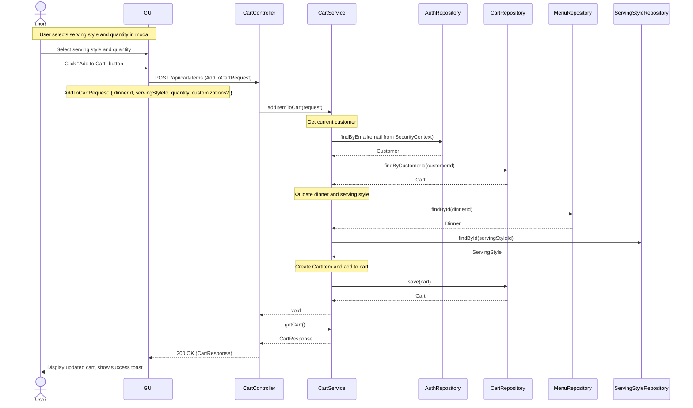
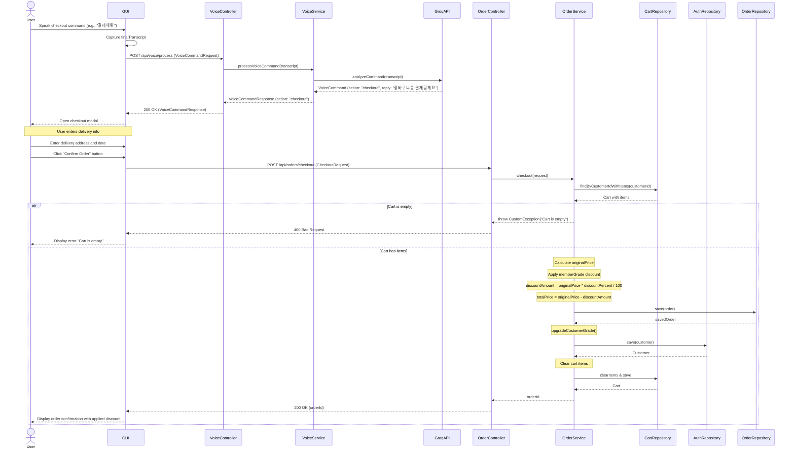
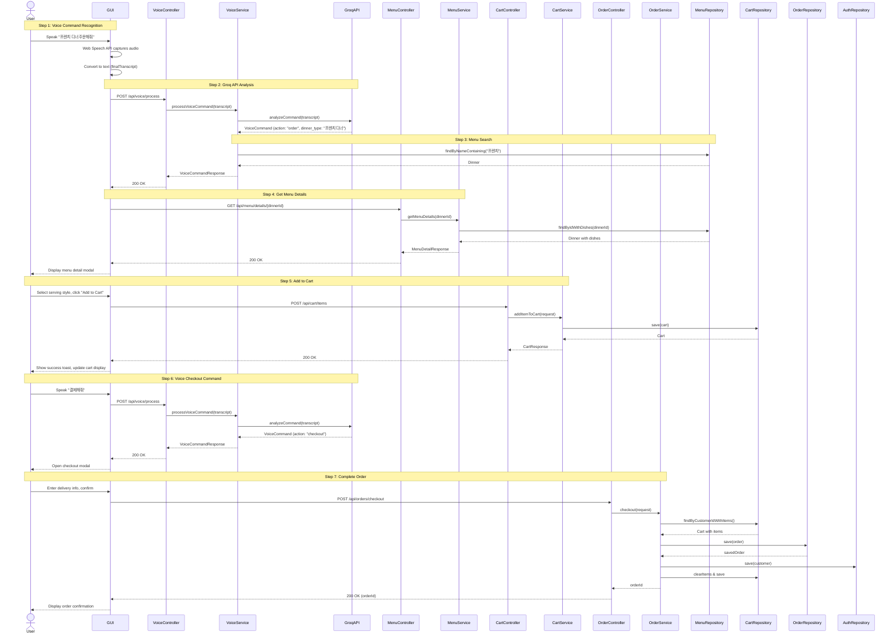

# Voice Recognition - Sequence Diagrams

This document contains sequence diagrams for the voice recognition feature that uses Groq API for menu recommendation and cart management.

---

## Overview

The voice recognition feature allows users to:
1. Request menu recommendations via voice commands
2. Add recommended items to cart
3. Proceed to checkout using voice commands

---

# Part 1: Sequence Diagrams (User-System Interaction)

Simple sequence diagrams showing interactions between User and System.

---

## 1-1. Voice Menu Recommendation



---

## 1-2. Voice Add to Cart



---

## 1-3. Voice Checkout



---

## 1-4. Complete Voice Order Flow



---

# Part 2: System Sequence Diagrams (Detailed Layer Interaction)

Detailed sequence diagrams showing interactions between User, GUI, Controller, Service, and Repository layers.

---

## 2-1. Voice Command Processing with Groq API



---

## 2-2. Voice Menu Recommendation and Selection



---

## 2-3. Voice Add to Cart



---

## 2-4. Voice Checkout



---

## 2-5. Complete Voice Order Flow (End-to-End)



---

# Appendix

## Voice Command Types

| Action | Trigger Keywords | Description |
|--------|-----------------|-------------|
| order | "주문", "추천", "시켜줘" | Request menu recommendation |
| checkout | "결제", "체크아웃", "주문완료" | Proceed to checkout |
| cancel | "취소", "삭제" | Cancel current action |
| unknown | (unrecognized) | Unrecognized command |

## VoiceCommand Interface

```typescript
interface VoiceCommand {
  action: "order" | "cancel" | "checkout" | "unknown";
  dinner_type?: string;      // Recommended dinner name
  serving_style?: string;    // Suggested serving style
  quantity?: number;         // Suggested quantity
  reply: string;             // Response message to display
}
```

## API Endpoints Summary

| Method | Endpoint | Description |
|--------|----------|-------------|
| POST | /api/voice/process | Process voice command with Groq API |
| GET | /api/menu/list | Get all menu items |
| GET | /api/menu/details/{id} | Get menu details with dishes and styles |
| POST | /api/cart/items | Add item to cart |
| GET | /api/cart | Get current cart |
| POST | /api/orders/checkout | Create order from cart |

## Technology Stack

| Component | Technology |
|-----------|------------|
| Speech Recognition | Web Speech API (react-speech-recognition) |
| Voice Command Analysis | Groq API (LLM) |
| Frontend | React + TypeScript |
| State Management | React Query |
| Backend | Spring Boot |

## Error Handling

| Error Case | User Feedback |
|-----------|---------------|
| Browser doesn't support speech | Display alert: "Chrome 브라우저를 사용해주세요" |
| Menu not found | Toast: "{menu_name} 메뉴를 찾을 수 없습니다" |
| Cart is empty | Toast: "장바구니가 비어있습니다" |
| Voice command unrecognized | Toast: "다시 말씀해주세요" |
| Network error | Toast with error message |
