# DdoganZip Detailed Sequence Diagrams

This document contains detailed sequence diagrams showing interactions between User, GUI, Controller, Service, and Repository layers.

---

## 1. Register

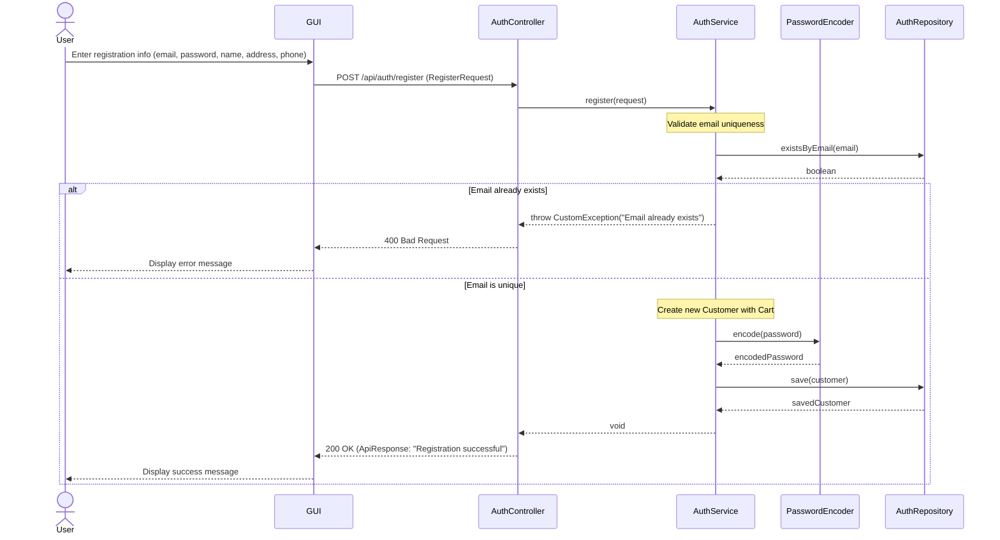

---

## 2. Login

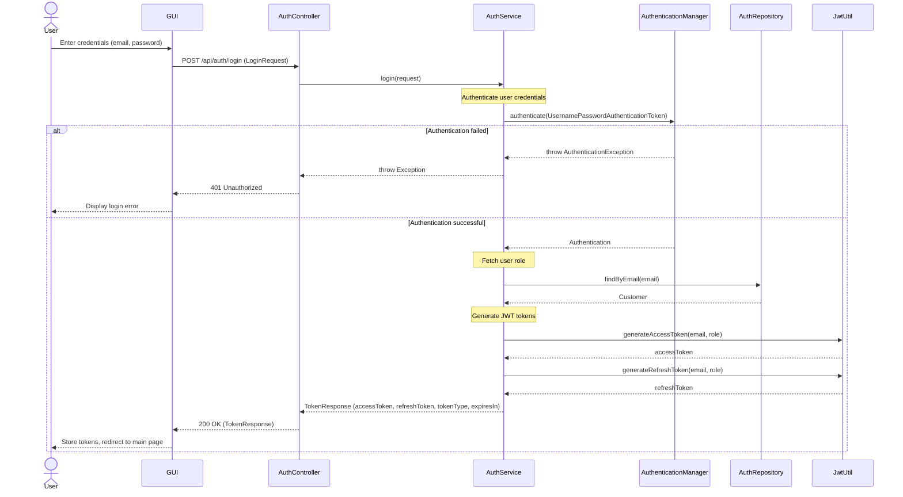

---

## 3. View Menu

### 3-1. Get Menu List

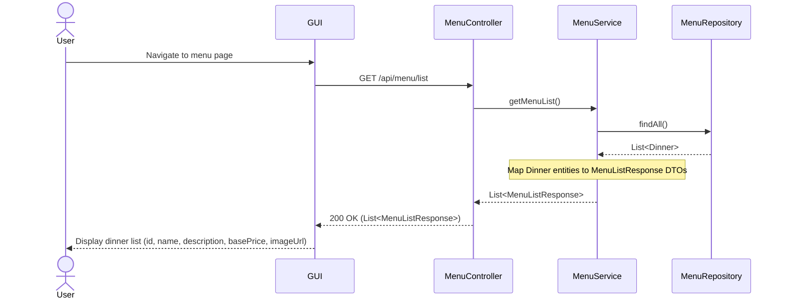

### 3-2. Get Menu Details

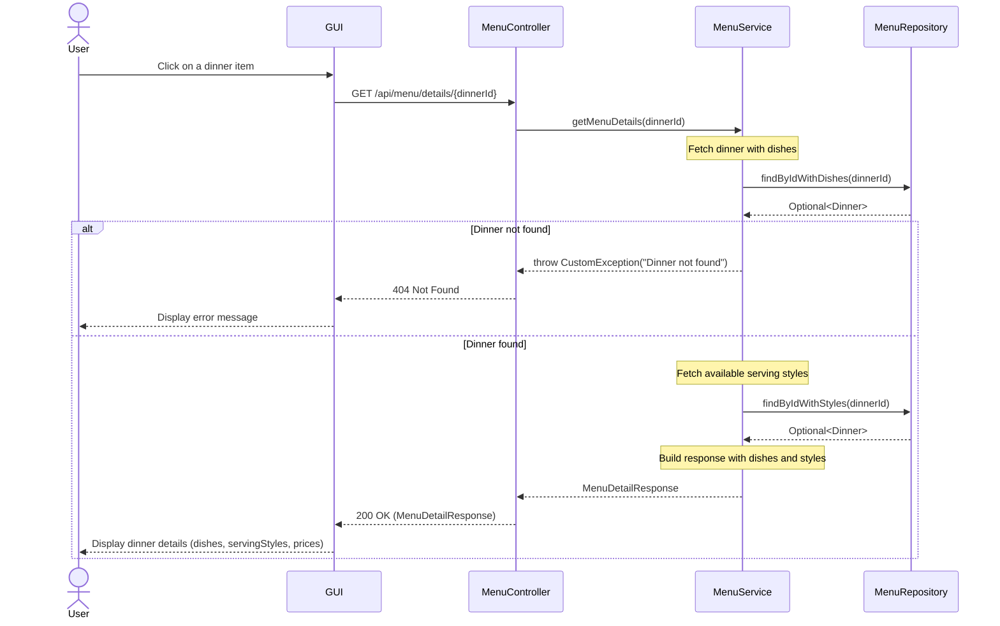

---

## 4. Manage Cart

### 4-1. Get Cart

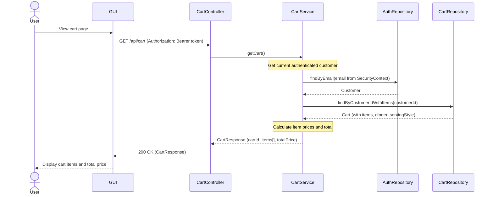

### 4-2. Add Item to Cart

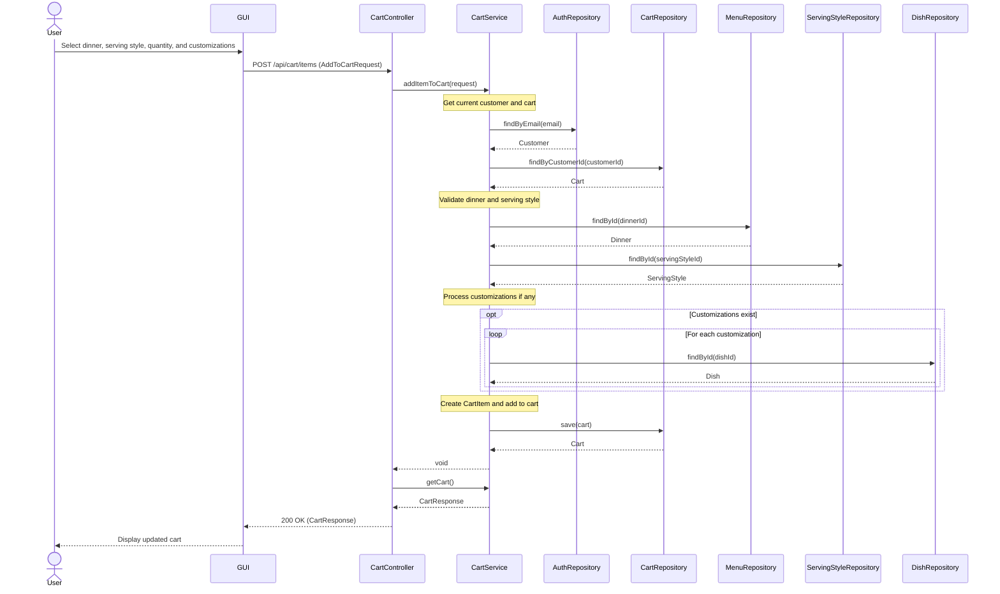

### 4-3. Update Item Quantity

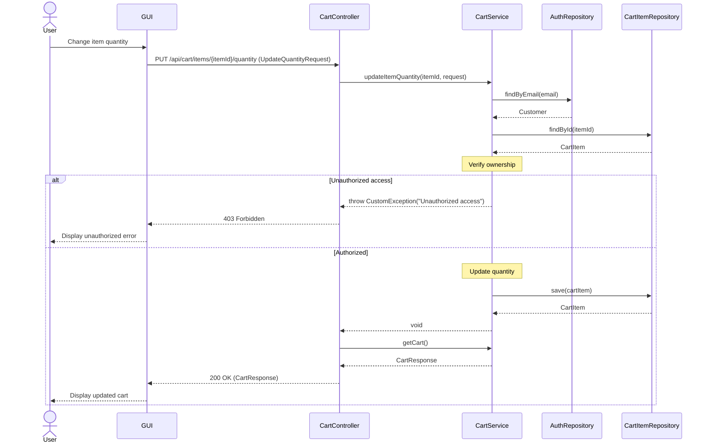

### 4-4. Update Item Options (Serving Style)

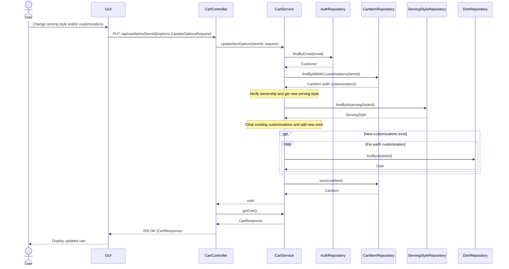

### 4-5. Customize Cart Item (Add/Remove Dish)

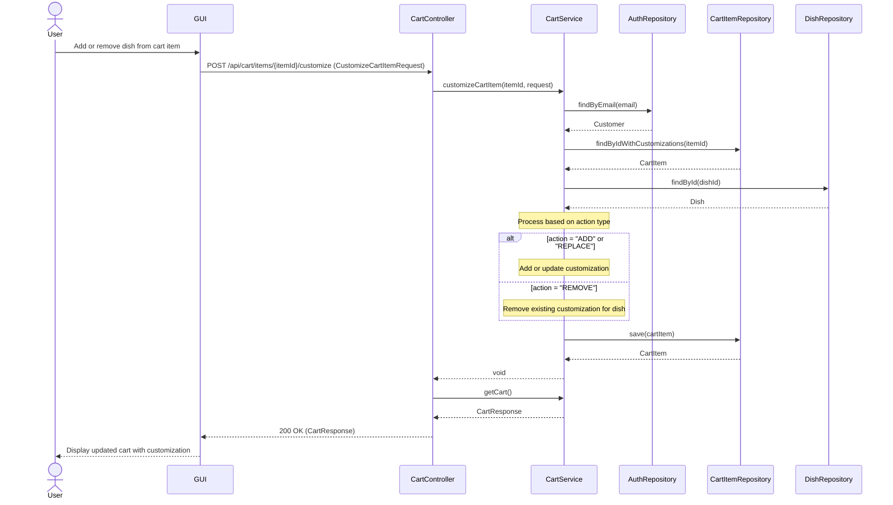

### 4-6. Remove Item from Cart

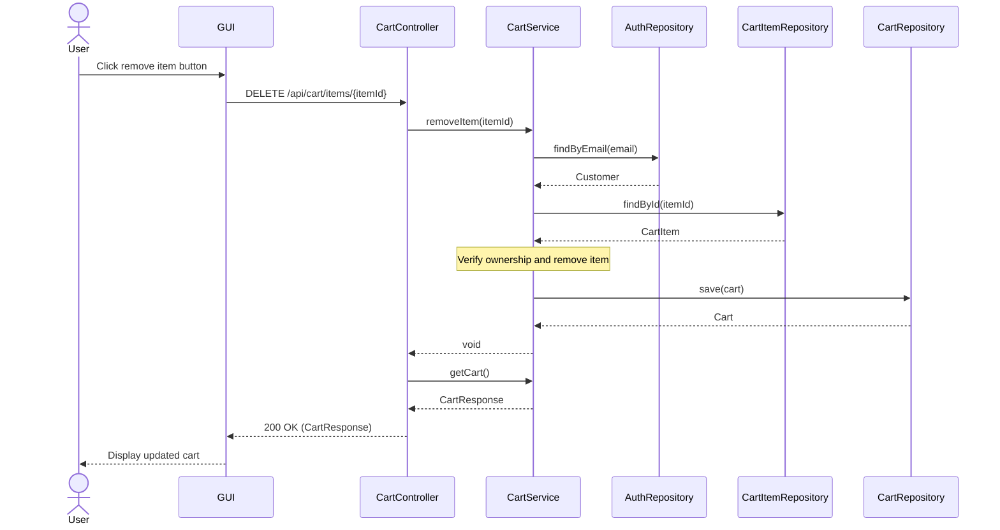

---

## 5. Checkout

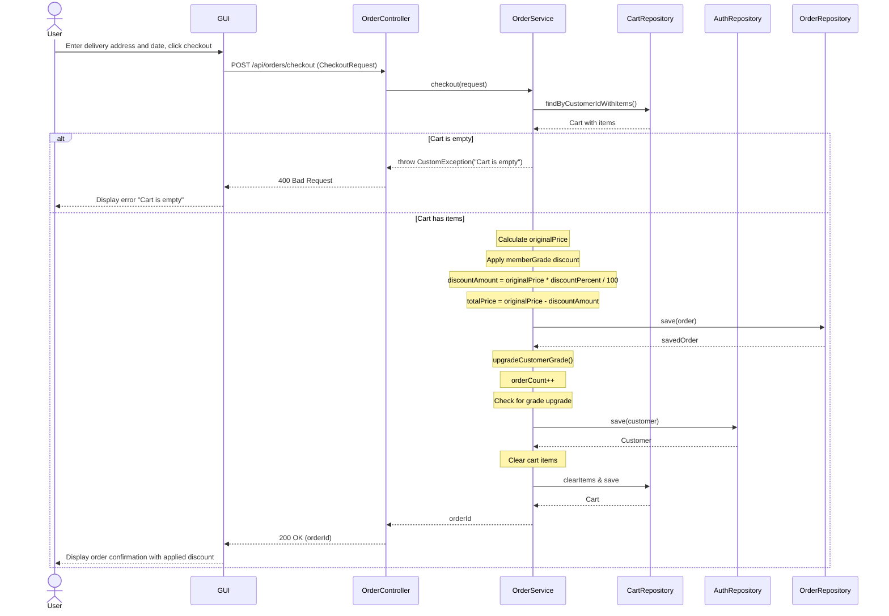

---

## 6. View Order

### 6-1. User - Get Order History

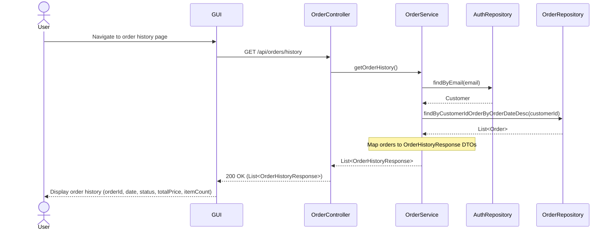

### 6-2. User - Get Order Details

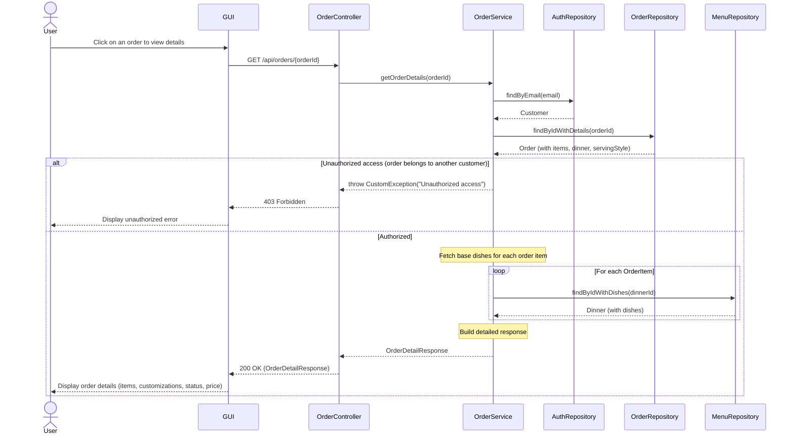

### 6-3. Staff - Get Active Orders

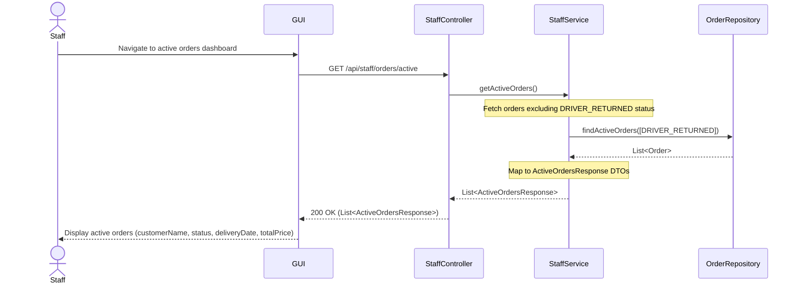

---

## 7. Manage Status (Staff Only)

### 7-1. Update Order Status

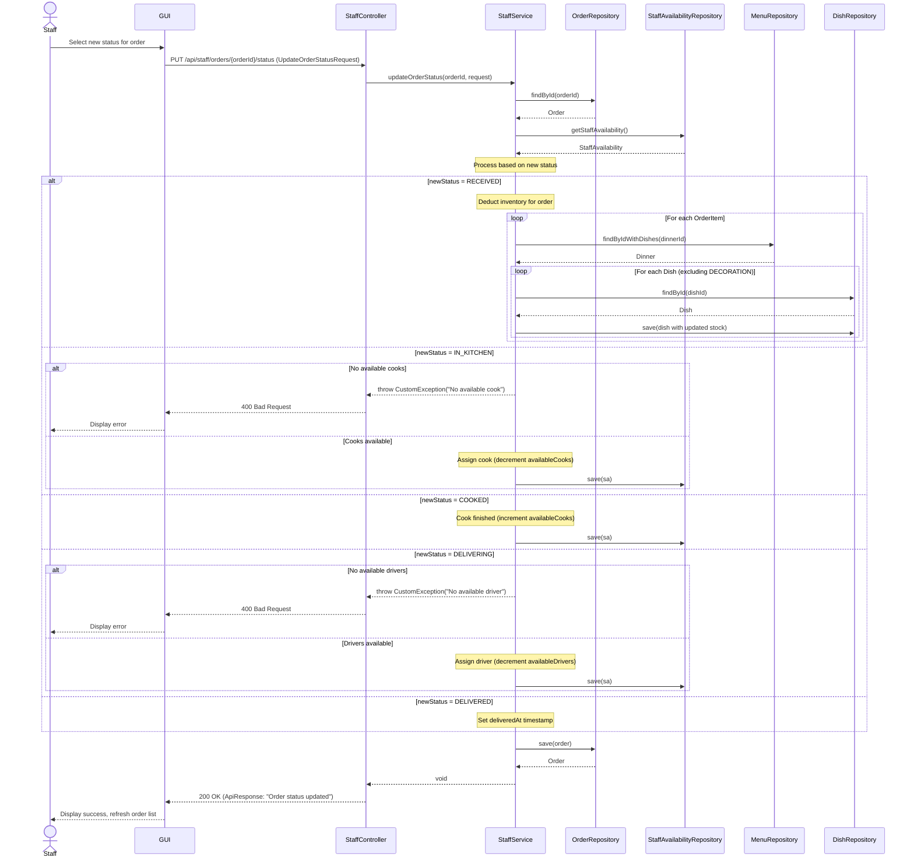

### 7-2. Check Inventory

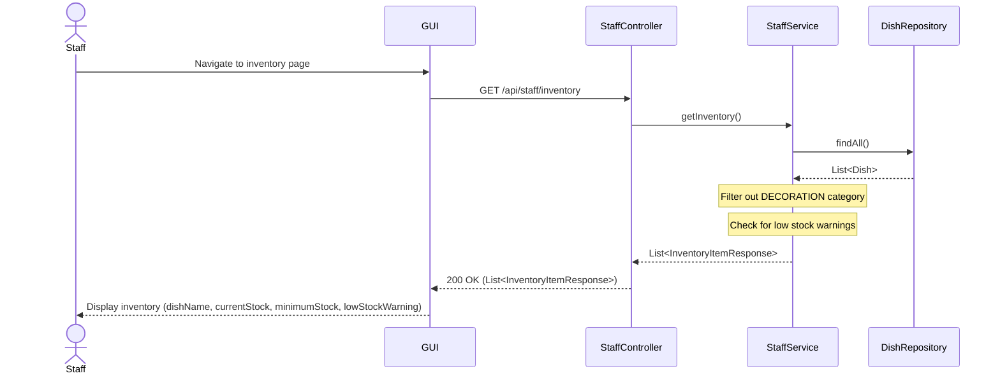

### 7-3. Check Order Inventory (Can Fulfill Order)

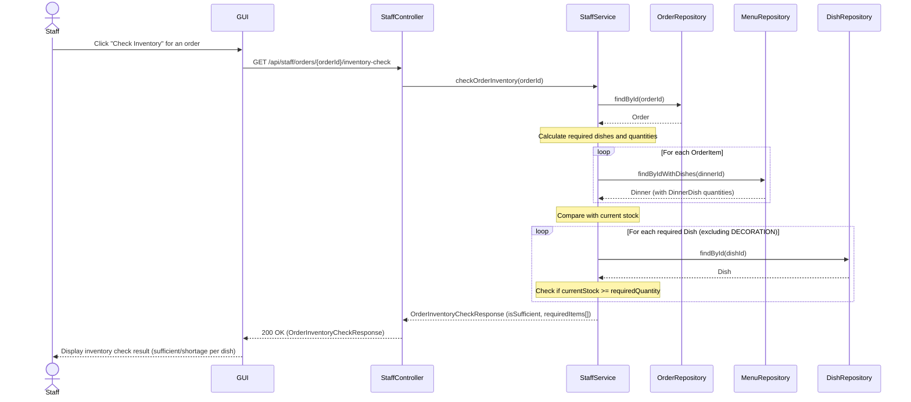

### 7-4. Driver Return

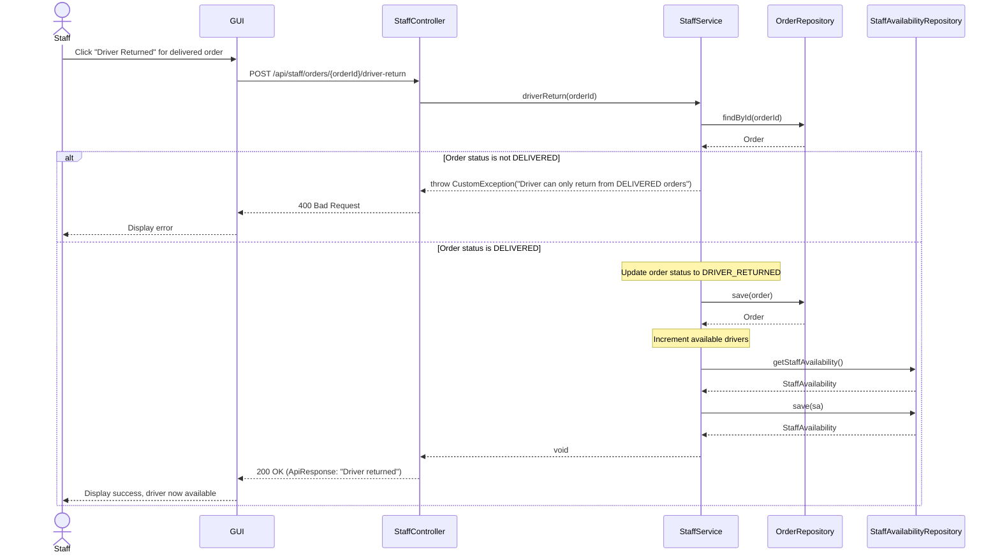

### 7-5. Get Staff Availability

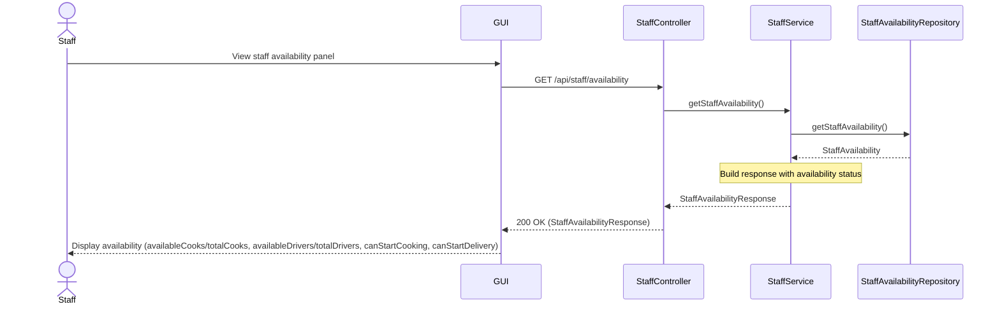

---

## Order Status Workflow Summary

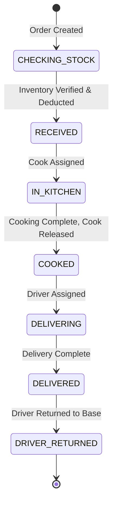

---

## Appendix: Key Method Mappings

| Layer | Class | Method | Purpose |
|-------|-------|--------|---------|
| Controller | AuthController | register() | Handle user registration |
| Controller | AuthController | login() | Handle user login |
| Controller | MenuController | getMenuList() | Get all dinners |
| Controller | MenuController | getMenuDetails() | Get dinner details |
| Controller | CartController | getCart() | Get user's cart |
| Controller | CartController | addItemToCart() | Add item to cart |
| Controller | CartController | updateItemQuantity() | Update cart item quantity |
| Controller | CartController | updateItemOptions() | Update serving style |
| Controller | CartController | customizeCartItem() | Add/remove dishes |
| Controller | CartController | removeItem() | Remove cart item |
| Controller | OrderController | checkout() | Create order from cart |
| Controller | OrderController | getOrderHistory() | Get user's orders |
| Controller | OrderController | getOrderDetails() | Get order details |
| Controller | StaffController | getActiveOrders() | Get all active orders |
| Controller | StaffController | updateOrderStatus() | Update order status |
| Controller | StaffController | getInventory() | Get inventory list |
| Controller | StaffController | checkOrderInventory() | Check order fulfillment |
| Controller | StaffController | getStaffAvailability() | Get cook/driver availability |
| Controller | StaffController | driverReturn() | Mark driver as returned |
| Service | AuthService | register() | Create new customer |
| Service | AuthService | login() | Authenticate and generate tokens |
| Service | MenuService | getMenuList() | Fetch all dinners |
| Service | MenuService | getMenuDetails() | Fetch dinner with dishes and styles |
| Service | CartService | getCart() | Fetch cart with items |
| Service | CartService | addItemToCart() | Create and add CartItem |
| Service | CartService | updateItemQuantity() | Update CartItem quantity |
| Service | CartService | updateItemOptions() | Update CartItem options |
| Service | CartService | customizeCartItem() | Handle customization actions |
| Service | CartService | removeItem() | Remove CartItem from cart |
| Service | OrderService | checkout() | Create Order from Cart |
| Service | OrderService | getOrderHistory() | Fetch customer orders |
| Service | OrderService | getOrderDetails() | Fetch order with details |
| Service | StaffService | getActiveOrders() | Fetch non-completed orders |
| Service | StaffService | updateOrderStatus() | Handle status transitions |
| Service | StaffService | getInventory() | Fetch all dishes stock |
| Service | StaffService | checkOrderInventory() | Verify order can be fulfilled |
| Service | StaffService | getStaffAvailability() | Get staff counts |
| Service | StaffService | driverReturn() | Handle driver return |
| Repository | AuthRepository | findByEmail() | Find customer by email |
| Repository | AuthRepository | existsByEmail() | Check email exists |
| Repository | MenuRepository | findAll() | Get all dinners |
| Repository | MenuRepository | findByIdWithDishes() | Get dinner with dishes |
| Repository | MenuRepository | findByIdWithStyles() | Get dinner with styles |
| Repository | CartRepository | findByCustomerId() | Find cart by customer |
| Repository | CartRepository | findByCustomerIdWithItems() | Find cart with items |
| Repository | CartItemRepository | findById() | Find cart item |
| Repository | CartItemRepository | findByIdWithCustomizations() | Find with customizations |
| Repository | OrderRepository | findByCustomerIdOrderByOrderDateDesc() | Customer orders |
| Repository | OrderRepository | findByIdWithDetails() | Order with items |
| Repository | OrderRepository | findActiveOrders() | Active orders for staff |
| Repository | DishRepository | findAll() | Get all dishes |
| Repository | DishRepository | findById() | Find dish by id |
| Repository | StaffAvailabilityRepository | getStaffAvailability() | Get singleton availability |
